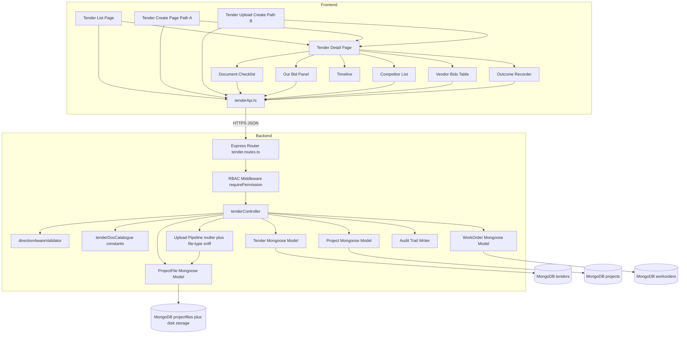
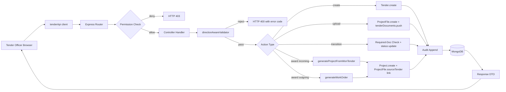
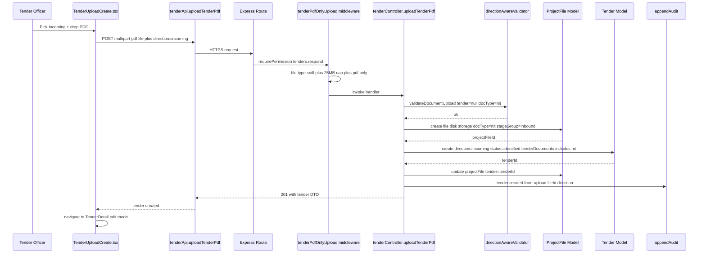
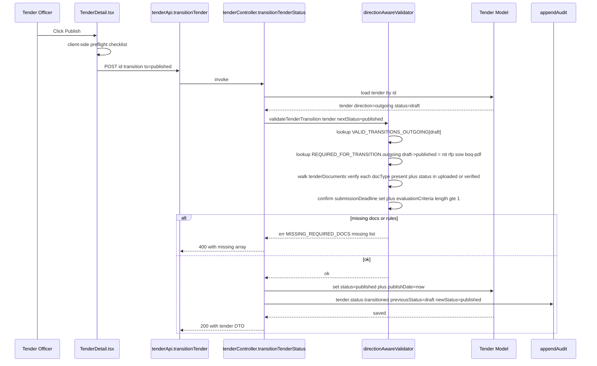
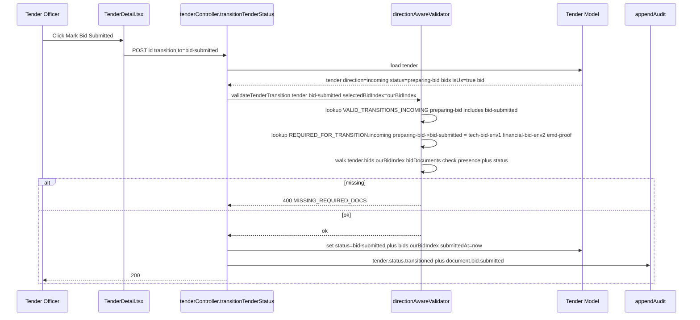
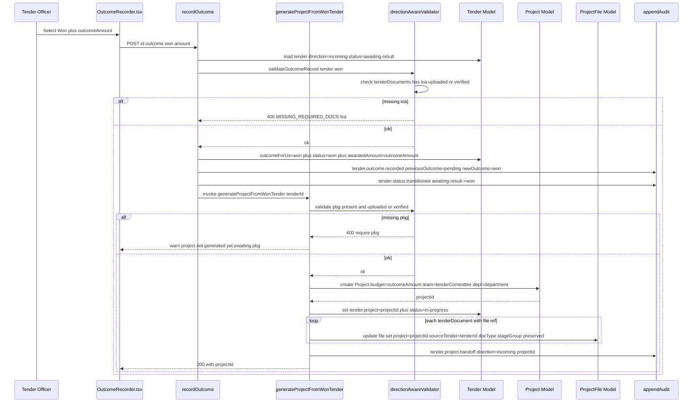
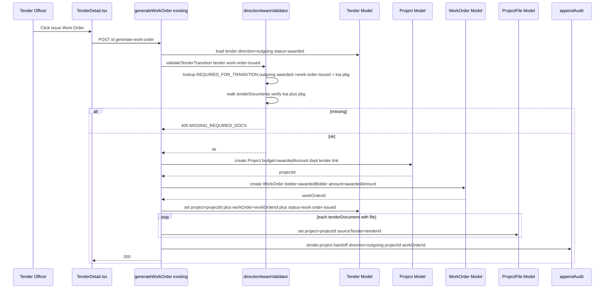

# Design Document

## Overview

This design implements the **Tender Project Workflow** feature for RayERP. The feature reshapes the existing single-direction Tender subsystem into a bi-directional one driven by a foundational `direction: 'incoming' | 'outgoing'` discriminator. All downstream concerns — UI rendering, validation, lifecycle states, document catalogue grouping, RBAC scope, and the win/award-to-Project handoff — branch from this single field.

**Design goals**

1. Add `direction` as the foundational discriminator on `Tender`, with default `'outgoing'` so legacy data is preserved.
2. Replace the flat `documents: string[]` arrays on tenders and bids with a typed, status-aware, audit-traceable `tenderDocuments[]` / `bidDocuments[]` model that references the existing `ProjectFile` storage layer.
3. Introduce a single canonical 25-code `docType` enum plus a 26th `unclassified-legacy` slot for migrated data. Stage grouping flips by direction; the codes themselves do not.
4. Split the lifecycle state machine into two direction-specific transition maps (`VALID_TRANSITIONS_INCOMING`, `VALID_TRANSITIONS_OUTGOING`) and gate each transition on the presence and status of the required documents for that `(direction, from, to)` triple.
5. Add competitor tracking on incoming tenders via `bids[].isUs: boolean` plus an `outcomeForUs` summary field.
6. Mirror the existing outgoing-side `generateWorkOrder` flow with a new incoming-side `generateProjectFromWonTender` flow that auto-creates a Project from a won bid and migrates the relevant `tenderDocuments` into the Project file area.
7. Deliver a direction-aware frontend (List, Detail with direction-conditional tabs, Form, Upload-driven create, Document Checklist, Our Bid panel, Competitor list, Vendor Bid table, Outcome recorder, Timeline) that reuses one rendering pipeline driven by the direction-aware catalogue.
8. Provide a non-destructive migration script: default `direction = 'outgoing'`, lift legacy strings as `docType = 'unclassified-legacy'`, leave the old `documents` array read-only for one release.

**Scope boundary.** OCR/auto-parse of NIT/RFP PDFs, e-procurement portal integration (CPP, GeM, state portals), cross-tender competitor analytics, and automated EMD return tracking are out of scope and are surfaced as future-spec hooks only.

## Architecture Design

### System Architecture Diagram



### Data Flow Diagram



## Component Design

### Component: Direction-Aware Validator (`backend/src/validators/tenderDirectionValidator.ts`, NEW)

- **Responsibilities**
  - Single entry point for any state-changing tender request (create, update, document upload/replace/delete, status change, outcome record, bid add/edit, project handoff invocation).
  - Resolves `tender.direction`, then dispatches to either `incomingTenderValidator` or `outgoingTenderValidator`.
  - Consults `VALID_TRANSITIONS_INCOMING` / `VALID_TRANSITIONS_OUTGOING` (Requirement 8).
  - Consults `REQUIRED_FOR_TRANSITION` and walks `tender.tenderDocuments` (and the selected `bid.bidDocuments` when applicable) to confirm presence + `status in ('uploaded', 'verified')` (Requirement 9).
  - Enforces the `isUs` invariants on `bids[]` (exactly one `isUs=true` on incoming; zero on outgoing) (Requirement 6).
  - Enforces immutability of `direction` (Requirement 1.3).
  - Returns a typed `ValidationResult` `{ ok: true } | { ok: false, code: ErrorCode, missing?: TenderDocType[], message: string }`.
- **Interfaces**
  ```ts
  export type DirectionErrorCode =
    | 'TENDER_DIRECTION_IMMUTABLE'
    | 'INVALID_TRANSITION_FOR_DIRECTION'
    | 'MISSING_REQUIRED_DOCS'
    | 'ISUS_INVARIANT_VIOLATED'
    | 'INVALID_DOC_TYPE'
    | 'INVALID_STAGE_GROUP_FOR_DIRECTION'
    | 'OUTCOME_INVALID_FOR_DIRECTION';

  export interface ValidationOk { ok: true; }
  export interface ValidationErr {
    ok: false;
    code: DirectionErrorCode;
    message: string;
    missing?: TenderDocType[];
    legalNextStates?: TenderStatus[];
  }
  export type ValidationResult = ValidationOk | ValidationErr;

  export function validateTenderTransition(
    tender: ITender,
    nextStatus: TenderStatus,
    selectedBidIndex?: number,
  ): ValidationResult;

  export function validateDocumentUpload(
    tender: ITender,
    docType: TenderDocType,
    isBidDocument: boolean,
  ): ValidationResult;

  export function validateBidIsUsInvariants(
    tender: ITender,
    nextBids: IBid[],
  ): ValidationResult;

  export function validateOutcomeRecord(
    tender: ITender,
    nextOutcome: OutcomeForUs,
  ): ValidationResult;
  ```
- **Dependencies**: `tenderDocCatalogue` constants, `Tender` model interfaces.

### Component: Tender Document Catalogue (`backend/src/constants/tenderDocTypes.ts`, NEW)

- **Responsibilities**
  - Export the canonical 25-code `TENDER_DOC_TYPES` plus the `'unclassified-legacy'` migration code.
  - Provide per-doc-type metadata (label, description, default mime allowlist, max size MB).
  - Provide direction-specific stage groupings.
  - Provide `REQUIRED_FOR_TRANSITION` declarative map keyed by `(direction, from, to)`.
- **Interfaces**
  ```ts
  export const TENDER_DOC_TYPES = {
    NIT: 'nit',
    RFP: 'rfp',
    SOW: 'sow',
    BOQ_PDF: 'boq-pdf',
    TECH_SPECS: 'tech-specs',
    DRAWINGS: 'drawings',
    GCC_SCC: 'gcc-scc',
    PRE_BID_MINUTES: 'pre-bid-minutes',
    CORRIGENDA: 'corrigenda',
    TECH_BID_ENV1: 'tech-bid-env1',
    FINANCIAL_BID_ENV2: 'financial-bid-env2',
    EMD_PROOF: 'emd-proof',
    CO_REGISTRATION: 'co-registration',
    PAN_GST: 'pan-gst',
    TAX_CLEARANCE: 'tax-clearance',
    CLASS_REGISTRATION: 'class-registration',
    EXPERIENCE_CERTS: 'experience-certs',
    AUDITED_FINANCIALS: 'audited-financials',
    LOA: 'loa',
    PBG: 'pbg',
    SD_RECEIPT: 'sd-receipt',
    SIGNED_AGREEMENT: 'signed-agreement',
    WORK_ORDER_DOC: 'work-order-doc',
    INSURANCE: 'insurance',
    SITE_HANDOVER: 'site-handover',
    UNCLASSIFIED_LEGACY: 'unclassified-legacy',
  } as const;

  export type TenderDocType = typeof TENDER_DOC_TYPES[keyof typeof TENDER_DOC_TYPES];

  export interface DocTypeMetadata {
    label: string;
    description: string;
    defaultMime: string[];
    maxSizeMb: number;
    repeatable: boolean;
  }

  export const DOC_TYPE_METADATA: Record<TenderDocType, DocTypeMetadata>;

  export type IncomingStageGroup = 'inbound' | 'our-submission' | 'post-award';
  export type OutgoingStageGroup = 'tender-publish' | 'vendor-bid' | 'post-award';
  export type StageGroup = IncomingStageGroup | OutgoingStageGroup;

  export const INCOMING_STAGE_GROUPS: Record<TenderDocType, IncomingStageGroup | null>;
  export const OUTGOING_STAGE_GROUPS: Record<TenderDocType, OutgoingStageGroup | null>;

  export function resolveStageGroup(
    direction: TenderDirection,
    docType: TenderDocType,
  ): StageGroup | null;

  export const REQUIRED_FOR_TRANSITION: {
    incoming: Record<`${IncomingStatus}->${IncomingStatus}`, TenderDocType[]>;
    outgoing: Record<`${OutgoingStatus}->${OutgoingStatus}`, TenderDocType[]>;
  };

  // Sample population (excerpt):
  // REQUIRED_FOR_TRANSITION.outgoing['draft->published'] = [nit, rfp, sow, boq-pdf]
  // REQUIRED_FOR_TRANSITION.outgoing['evaluation->awarded'] = [] (gates on selected bid)
  // REQUIRED_FOR_TRANSITION.outgoing['awarded->work-order-issued'] = [loa, pbg]
  // REQUIRED_FOR_TRANSITION.incoming['preparing-bid->bid-submitted'] = [tech-bid-env1, financial-bid-env2, emd-proof]
  // REQUIRED_FOR_TRANSITION.incoming['awaiting-result->won'] = [loa]
  // REQUIRED_FOR_TRANSITION.incoming['won->in-progress'] = [pbg] (gating doc for project generation)
  ```
- **Dependencies**: none (pure constants module).

### Component: Tender Controller (`backend/src/controllers/tenderController.ts`, EXTEND)

- **Responsibilities** — same as today plus:
  - **Direction-aware** `createTender` (initial status = `'draft'` for outgoing, `'identified'` for incoming; reject if user lacks the matching create permission).
  - **`uploadTenderPdf`** (new) — Path B entry; accepts a single PDF, persists via `ProjectFile`, creates a Tender shell with `tenderDocuments[0] = { docType: 'nit', file, status: 'uploaded' }`.
  - **Tender-level document CRUD**: `addTenderDocument`, `replaceTenderDocument`, `deleteTenderDocument`, `setTenderDocumentStatus`.
  - **Bid-level document CRUD**: `addBidDocument`, `replaceBidDocument`, `deleteBidDocument`, `setBidDocumentStatus`.
  - **Competitor management**: `addCompetitorBid`, `updateCompetitorBid`, `deleteCompetitorBid` — all only meaningful when `direction === 'incoming'`.
  - **Direction-split `VALID_TRANSITIONS_INCOMING` / `VALID_TRANSITIONS_OUTGOING`** plus `validateTransition` delegating to the validator component above.
  - **`generateProjectFromWonTender`** (new) — incoming-side counterpart to `generateWorkOrder`.
  - **`recordOutcome`** (new) — sets `outcomeForUs` and, on `won`, triggers the project handoff if the gating docs are present.
  - **`reclassifyLegacyDocument`** — re-assign a doctype on entries carrying `docType = 'unclassified-legacy'` (requires `tenders.manage`).
- **Interfaces**: exposed via the routes table below.
- **Dependencies**: Tender model, ProjectFile model, Project model, WorkOrder model, validator, catalogue, upload pipeline, audit-trail writer.

### Component: Upload Pipeline (`backend/src/middleware/tenderUpload.middleware.ts`, NEW)

- **Responsibilities**
  - multer with disk storage (per Non-Functional design note below — disk is preferred for tender PDFs over the model's current `database` default because tender corpora are large and frequent).
  - 25 MB per-file cap (returns HTTP 413 on overflow).
  - MIME sniff via `file-type` (npm package) instead of trusting extension or `Content-Type` header. Reject mismatches with HTTP 415.
  - Allowlist: `application/pdf`, `image/png`, `image/jpeg`, `image/jpg`, `image/webp`. Path B (upload-driven create) is restricted to `application/pdf` only.
  - Virus-scan hook point — exports an async `runMalwareScan(buffer)` no-op stub that future ClamAV integration replaces; on rejection returns HTTP 422.
- **Interfaces**
  ```ts
  export const tenderDocumentUpload: RequestHandler;       // multi-mime
  export const tenderPdfOnlyUpload: RequestHandler;        // Path B
  export async function runMalwareScan(buffer: Buffer): Promise<{ clean: boolean; reason?: string }>;
  ```

### Component: Audit Trail Writer (existing pattern, reuse)

- **Responsibilities**: append immutable entries to `tender.auditTrail` for every state-changing action. New action codes are defined in the Audit Trail section below.
- **Interface**:
  ```ts
  function appendAudit(tender: ITender, entry: ITenderAuditEntry): void;
  ```

### Component: Migration Script (`backend/src/scripts/migrateTendersToDirection.ts`, NEW)

- **Responsibilities**
  - For every Tender lacking `direction`, set `direction = 'outgoing'` and append `tender.direction.defaulted-outgoing` audit entry.
  - For every legacy string in `documents[]`, create a `tenderDocuments` entry with `docType = 'unclassified-legacy'`, `stageGroup` resolved via outgoing semantics (defaults to `tender-publish`), `status = 'uploaded'`, `notes = 'Migrated from legacy documents array'`, and `file` either resolved (lookup ProjectFile by path) or created as a placeholder ProjectFile pointing at the original path.
  - Repeat for each `bid.documents[]` (bids on migrated outgoing tenders get `isUs = false`).
  - Leave the legacy `documents: string[]` field intact for one release; append `tender.documents.migrated` audit entry per Tender.
  - For each Role that previously held `tenders.create`, grant `tenders.issue`. Do **not** auto-grant `tenders.respond` or `tenders.competitor-intel`.
- **Dependencies**: Tender model, ProjectFile model, Role model.

### Component: Frontend `tenderApi.ts` (`frontend/src/api/tenderApi.ts`, NEW)

- **Responsibilities**: typed wrapper around all new + modified endpoints. Mirrors the existing patterns from `boqApi.ts`.
- **Interfaces**: see API Surface section below for the function-by-function mapping.

### Component: Frontend Hooks

- `frontend/src/hooks/useTenders.ts` — list/detail react-query hooks (`useTenderList`, `useTender`, `useCreateTender`, `useUpdateTender`, `useTransitionTender`, `useRecordOutcome`, `useGenerateProjectFromWonTender`).
- `frontend/src/hooks/useTenderDocuments.ts` — `useUploadTenderDocument`, `useReplaceTenderDocument`, `useDeleteTenderDocument`, `useSetTenderDocumentStatus`, and the equivalent bid-document variants.

### Component: Frontend Pages and Components

| Path | Role |
|---|---|
| `frontend/src/pages/tenders/TenderList.tsx` | Paginated table with `Incoming/Outgoing/All` segmented control persisted in the URL. |
| `frontend/src/pages/tenders/TenderDetail.tsx` | Direction-aware tabs orchestration. |
| `frontend/src/pages/tenders/TenderCreate.tsx` | Hosts the direction picker plus the Path A/Path B switch. |
| `frontend/src/components/tender/TenderForm.tsx` | Multi-step form (Basic, Scope, Financials, Timeline, Evaluation, Documents). Field labels and visibility branch on `direction`. |
| `frontend/src/components/tender/TenderUploadCreate.tsx` | Path B uploader. Primary for incoming; behind a feature flag for outgoing. |
| `frontend/src/components/tender/TenderDocumentChecklist.tsx` | Renders catalogue entries as labelled slot cards driven by `(direction, stageGroup, documents)`. Required indicator, status badge, upload/replace/delete, history link. |
| `frontend/src/components/tender/OurBidPanel.tsx` | Incoming only. Shows the `isUs=true` bid prominently with its `bidDocuments` checklist. |
| `frontend/src/components/tender/CompetitorList.tsx` | Incoming only. Lists `isUs=false` bids. Gated by `tenders.competitor-intel`. |
| `frontend/src/components/tender/VendorBidsTable.tsx` | Outgoing only. Lists vendor bids, supports Select Bid + score. |
| `frontend/src/components/tender/TenderTimeline.tsx` | Renders `timeline[]` and `auditTrail[]` in chronological order. |
| `frontend/src/components/tender/OutcomeRecorder.tsx` | Incoming only. Sets `outcomeForUs`. On `won` triggers Project handoff if gating docs are present. |

All components match the existing BOQ component patterns (`'use client'`, `useQuery/useMutation` hooks, `Card`, `Badge`, `Button`, `Progress` from `@/components/ui/*`, lucide icons, `useGlobalCurrency`).

## Data Model

### TenderDirection and OutcomeForUs (NEW unions)

```ts
export type TenderDirection = 'incoming' | 'outgoing';
export type OutcomeForUs = 'won' | 'lost' | 'cancelled' | 'withdrawn' | 'pending';
```

### Direction-Aware Status Unions (Requirement 8)

```ts
export type IncomingStatus =
  | 'identified'
  | 'evaluating-pursuit'
  | 'preparing-bid'
  | 'bid-submitted'
  | 'awaiting-result'
  | 'won'
  | 'lost'
  | 'withdrawn-by-us'
  | 'cancelled'
  | 'in-progress'
  | 'completed';

export type OutgoingStatus =
  | 'draft'
  | 'published'
  | 'bid-submission'
  | 'evaluation'
  | 'negotiation'
  | 'awarded'
  | 'work-order-issued'
  | 'in-progress'
  | 'completed'
  | 'cancelled'
  | 'no-bid';

export type TenderStatus = IncomingStatus | OutgoingStatus;
```

### Typed Document Interfaces (Requirement 3)

```ts
export type DocumentStatus = 'pending' | 'uploaded' | 'verified' | 'rejected';

export interface ITenderDocument {
  _id?: mongoose.Types.ObjectId;
  docType: TenderDocType;
  stageGroup: StageGroup;            // resolved at write time from (direction, docType)
  required: boolean;                 // snapshot from policy at write time
  file?: mongoose.Types.ObjectId;    // ref ProjectFile (optional when status='pending')
  uploadedBy?: mongoose.Types.ObjectId;
  uploadedAt?: Date;
  status: DocumentStatus;
  notes?: string;
  version: number;                   // 1-based, monotonic per (tender, docType) chain
  replacedBy?: mongoose.Types.ObjectId; // _id of newer ITenderDocument that supersedes this one
}

export interface IBidDocument extends ITenderDocument {
  // identical shape; separately typed for code clarity and future divergence
}
```

### Extended Bid Interface (Requirement 6)

```ts
export interface IBid {
  // ... all existing fields preserved
  isUs: boolean;                     // NEW. true exactly once on incoming, never on outgoing.
  bidDocuments: IBidDocument[];      // NEW typed counterpart to legacy documents: string[]
  documents: string[];               // LEGACY, kept read-only for one release
}
```

### Extended ITender Interface

```ts
export interface ITender extends Document {
  // ...all existing fields preserved...

  direction: TenderDirection;                    // NEW, required, immutable after create
  tenderDocuments: ITenderDocument[];            // NEW typed catalogue
  documents: string[];                           // LEGACY, kept read-only for one release
  outcomeForUs?: OutcomeForUs;                   // NEW, present only when direction='incoming'
  bids: IBid[];                                  // unchanged at the array level; each bid extended
}
```

### Mongoose Schema Extensions

```ts
// tenderDocumentSchema (NEW)
const tenderDocumentSchema = new Schema<ITenderDocument>({
  docType: { type: String, required: true, enum: Object.values(TENDER_DOC_TYPES) },
  stageGroup: { type: String, required: true,
    enum: ['inbound', 'our-submission', 'post-award', 'tender-publish', 'vendor-bid'] },
  required: { type: Boolean, default: false },
  file: { type: Schema.Types.ObjectId, ref: 'ProjectFile' },
  uploadedBy: { type: Schema.Types.ObjectId, ref: 'User' },
  uploadedAt: { type: Date },
  status: { type: String, enum: ['pending', 'uploaded', 'verified', 'rejected'], default: 'pending' },
  notes: String,
  version: { type: Number, default: 1 },
  replacedBy: { type: Schema.Types.ObjectId },
});

// bidSchema extensions
bidSchema.add({
  isUs: { type: Boolean, default: false, index: true },
  bidDocuments: { type: [tenderDocumentSchema], default: [] },
});

// tenderSchema extensions
tenderSchema.add({
  direction: {
    type: String,
    enum: ['incoming', 'outgoing'],
    required: true,
    default: 'outgoing',                         // legacy back-compat
    immutable: true,                              // enforced at Mongoose layer + controller layer
  },
  tenderDocuments: { type: [tenderDocumentSchema], default: [] },
  outcomeForUs: {
    type: String,
    enum: ['won', 'lost', 'cancelled', 'withdrawn', 'pending'],
    // present only when direction='incoming' — validated in pre-save hook
  },
});

// Status enum union — both lists merged. Direction-specific validity is enforced by validator.
tenderSchema.path('status').enum([
  // incoming
  'identified','evaluating-pursuit','preparing-bid','bid-submitted','awaiting-result',
  'won','lost','withdrawn-by-us',
  // outgoing
  'draft','published','bid-submission','evaluation','negotiation','awarded','work-order-issued','no-bid',
  // shared
  'in-progress','completed','cancelled',
]);

// Optimistic concurrency: rely on Mongoose default __v version key for bids[] race protection.
tenderSchema.set('optimisticConcurrency', true);

// New indexes
tenderSchema.index({ direction: 1 });
tenderSchema.index({ direction: 1, status: 1 });
tenderSchema.index({ outcomeForUs: 1 });
tenderSchema.index({ 'tenderDocuments.docType': 1 });
tenderSchema.index({ 'bids.isUs': 1 });
```

### ProjectFile Schema Changes

Decision: **(a) make `project` optional, add `tender` and `sourceTender` refs plus `docType` metadata.** Justification: minimal duplication, one file API for both project- and tender-attached files, queryable by `tender` or by `project` independently, and the `sourceTender` link is the natural pointer that survives the handoff when `project` is later populated.

```ts
// ProjectFile additions
ProjectFileSchema.add({
  project: { type: Schema.Types.ObjectId, ref: 'Project', required: false }, // CHANGED to optional
  tender: { type: Schema.Types.ObjectId, ref: 'Tender' },                    // NEW: live link while tender owns it
  sourceTender: { type: Schema.Types.ObjectId, ref: 'Tender' },              // NEW: archival pointer after handoff
  docType: { type: String },                                                  // NEW: TenderDocType tag
  stageGroup: { type: String },                                               // NEW: snapshot at upload time
});

ProjectFileSchema.index({ tender: 1 });
ProjectFileSchema.index({ sourceTender: 1 });
ProjectFileSchema.index({ project: 1, sourceTender: 1 });
```

Invariant: at least one of `project`, `tender`, or `sourceTender` MUST be present. Enforced in a `pre-validate` hook so we never orphan a file.

### Storage Strategy

Tender corpora are PDF-heavy and high-count. The current `ProjectFile.storageType` default is `'database'`; we override to `'disk'` for `tenderDocumentUpload` calls. Justification: avoiding Mongo document bloat on multi-MB PDFs, faster list-page queries (no `fileData` projection cost), and standard backup tooling for disk artefacts.

## Business Process

### Process 1: Path B Upload-Driven Incoming Tender Creation (Requirement 5)



### Process 2: Outgoing Tender draft to published Transition (Requirement 9.1)



### Process 3: Incoming Tender preparing-bid to bid-submitted Transition (Requirement 9.4)



### Process 4: Incoming Tender awaiting-result to won with Project Auto-Creation (Requirements 7.1 and 9.5 and 9.6 and 13.1)



### Process 5: Outgoing Tender awarded to work-order-issued (Requirements 7.2 and 9.3 and 13.1)



## API Surface

All endpoints are nested under `/api/tenders` and require `protect` (JWT) middleware. The permission token is enforced by `requirePermission()` in `tender.routes.ts`.

### Tender CRUD (direction-aware)

| Method | Route | Permission | Controller | Notes |
|---|---|---|---|---|
| GET | `/` | `tenders.view` | `getAllTenders` | New query params: `direction`, `outcomeForUs`. |
| GET | `/:id` | `tenders.view` | `getTenderById` | Populates `tenderDocuments.file` (ProjectFile lite DTO). |
| POST | `/` | `tenders.respond` (if `direction='incoming'`) OR `tenders.issue` (if `direction='outgoing'`) | `createTender` | Selects permission dynamically from request body. |
| POST | `/upload-create` | `tenders.respond` OR `tenders.issue` | `uploadTenderPdf` | Path B. Multipart, PDF only. |
| PUT | `/:id` | `tenders.respond` OR `tenders.issue` (matched to `tender.direction`) | `updateTender` | Rejects any attempt to change `direction` with HTTP 400 `TENDER_DIRECTION_IMMUTABLE`. |
| DELETE | `/:id` | `tenders.delete` | `deleteTender` | Soft-delete; preserves audit. |

### Tender-Level Document Management

| Method | Route | Permission | Controller | Notes |
|---|---|---|---|---|
| POST | `/:id/documents` | direction-stage-matched permission (see RBAC matrix) | `addTenderDocument` | Body: `docType`, multipart file. Resolves `stageGroup` from catalogue. |
| PUT | `/:id/documents/:docId` | same as upload | `replaceTenderDocument` | Increments `version`, sets prior entry's `replacedBy`. |
| DELETE | `/:id/documents/:docId` | `tenders.manage` | `deleteTenderDocument` | Only allowed while tender is in its earliest editable state for its direction. Soft-deletes the ProjectFile (`isDeleted=true` on ProjectFile or equivalent). |
| PUT | `/:id/documents/:docId/status` | depends on stage-group: `tenders.respond` for our-submission incoming docs, `tenders.award` for post-award outgoing docs, `tenders.evaluate` otherwise | `setTenderDocumentStatus` | Body: `status: 'verified' \| 'rejected'`. |
| POST | `/:id/documents/:docId/reclassify` | `tenders.manage` | `reclassifyLegacyDocument` | Only valid when current `docType = 'unclassified-legacy'`. Body: `newDocType`. |

### Bid-Level Document Management

| Method | Route | Permission | Controller |
|---|---|---|---|
| POST | `/:id/bids/:bidIndex/documents` | `tenders.manage_bids` (our bid) or `tenders.competitor-intel` (competitor bid, incoming only) | `addBidDocument` |
| PUT | `/:id/bids/:bidIndex/documents/:docId` | same | `replaceBidDocument` |
| DELETE | `/:id/bids/:bidIndex/documents/:docId` | `tenders.manage` | `deleteBidDocument` |
| PUT | `/:id/bids/:bidIndex/documents/:docId/status` | `tenders.evaluate` | `setBidDocumentStatus` |

### Bid Management (with `isUs`)

| Method | Route | Permission | Controller | Notes |
|---|---|---|---|---|
| POST | `/:id/bids` | `tenders.manage_bids` | `addBidder` | Body: bid fields plus optional `isUs` (default false). Validator enforces incoming-exactly-one and outgoing-zero invariants. |
| PUT | `/:id/bids/:bidIndex/submit` | `tenders.manage_bids` | `submitBid` | Unchanged shape. |
| PUT | `/:id/bids/:bidIndex/evaluate` | `tenders.evaluate` | `evaluateBid` | Unchanged shape. |
| PUT | `/:id/bids/:bidIndex/status` | `tenders.evaluate` | `updateBidStatus` | Unchanged shape. |

### Competitor Management (incoming only)

| Method | Route | Permission | Controller |
|---|---|---|---|
| POST | `/:id/competitors` | `tenders.competitor-intel` | `addCompetitorBid` (alias for `addBidder` with `isUs=false`, validates direction='incoming') |
| PUT | `/:id/competitors/:bidIndex` | `tenders.competitor-intel` | `updateCompetitorBid` |
| DELETE | `/:id/competitors/:bidIndex` | `tenders.competitor-intel` | `deleteCompetitorBid` |

### Lifecycle Transitions

| Method | Route | Permission | Controller | Notes |
|---|---|---|---|---|
| POST | `/:id/transition` | `tenders.manage` | `transitionTenderStatus` | Body: `nextStatus`. Delegates to `validateTenderTransition`. |
| POST | `/:id/cancel` | `tenders.manage` | `cancelTender` | Convenience wrapper; same validator. |
| POST | `/:id/reset` | `tenders.manage` | `resetTender` | Resets to earliest editable state per direction. |

### Outcome Recording (incoming only)

| Method | Route | Permission | Controller |
|---|---|---|---|
| PUT | `/:id/outcome` | `tenders.respond` | `recordOutcome` |

Body: `{ outcome: 'won' \| 'lost' \| 'cancelled' \| 'withdrawn', amount?: number, notes?: string }`. On `won`, controller also attempts the project handoff inline if PBG is present; otherwise returns a 200 with a hint that project generation is pending PBG upload.

### Project Handoff

| Method | Route | Permission | Controller |
|---|---|---|---|
| POST | `/:id/generate-project` | `tenders.respond` | `generateProjectFromWonTender` (NEW) |
| POST | `/:id/generate-work-order` | `tenders.award` | `generateWorkOrder` (existing, reused) |

### Standard Error Response Shape

```json
{
  "success": false,
  "code": "MISSING_REQUIRED_DOCS",
  "message": "Cannot publish: required documents are missing.",
  "missing": ["nit", "rfp"],
  "legalNextStates": ["published", "cancelled"]
}
```

HTTP codes used: `400` validation/business-rule, `401` no auth, `403` permission, `404` not found, `409` concurrency conflict (Mongoose `VersionError` surfaces as 409), `413` file too large, `415` MIME mismatch, `422` malware scan reject.

## validateTransition Pseudocode

```ts
function validateTenderTransition(
  tender: ITender,
  nextStatus: TenderStatus,
  selectedBidIndex?: number,
): ValidationResult {
  // 1. Direction-specific map lookup
  const map = tender.direction === 'incoming'
    ? VALID_TRANSITIONS_INCOMING
    : VALID_TRANSITIONS_OUTGOING;

  const allowed = map[tender.status] ?? [];
  if (!allowed.includes(nextStatus as any)) {
    return {
      ok: false,
      code: 'INVALID_TRANSITION_FOR_DIRECTION',
      message: `Cannot transition ${tender.direction} tender from ${tender.status} to ${nextStatus}.`,
      legalNextStates: allowed,
    };
  }

  // 2. Required-doc lookup
  const key = `${tender.status}->${nextStatus}` as const;
  const requiredDocs =
    tender.direction === 'incoming'
      ? (REQUIRED_FOR_TRANSITION.incoming[key] ?? [])
      : (REQUIRED_FOR_TRANSITION.outgoing[key] ?? []);

  const missing: TenderDocType[] = [];

  // 3. Walk tenderDocuments
  for (const docType of requiredDocs) {
    // Tender-level docs (everything other than per-bid envelopes)
    const found = tender.tenderDocuments.find(
      d => d.docType === docType && (d.status === 'uploaded' || d.status === 'verified'),
    );
    if (found) continue;

    // 4. Drill into per-bid bidDocuments when applicable:
    //    Outgoing: evaluation->awarded uses the selected bid's bidDocuments for env1/env2/emd-proof.
    //    Incoming: preparing-bid->bid-submitted uses our (isUs=true) bid's bidDocuments.
    if (
      (tender.direction === 'outgoing'
        && tender.status === 'evaluation'
        && nextStatus === 'awarded')
      || (tender.direction === 'incoming'
        && tender.status === 'preparing-bid'
        && nextStatus === 'bid-submitted')
    ) {
      let bid: IBid | undefined;
      if (tender.direction === 'incoming') {
        bid = tender.bids.find(b => b.isUs);
      } else if (typeof selectedBidIndex === 'number') {
        bid = tender.bids[selectedBidIndex];
      } else {
        bid = tender.bids.find(b => b.status === 'selected');
      }
      const inBid = bid?.bidDocuments.find(
        d => d.docType === docType && (d.status === 'uploaded' || d.status === 'verified'),
      );
      if (inBid) continue;
    }

    missing.push(docType);
  }

  // 5. Extra outgoing rule: draft->published must also satisfy non-doc rules
  if (
    tender.direction === 'outgoing'
    && tender.status === 'draft'
    && nextStatus === 'published'
  ) {
    if (!tender.submissionDeadline)
      missing.push('__rule:submissionDeadline' as any);
    if (!tender.evaluationCriteria || tender.evaluationCriteria.length === 0)
      missing.push('__rule:evaluationCriteria' as any);
  }

  // 6. Outgoing evaluation->awarded requires exactly one selected bid
  if (
    tender.direction === 'outgoing'
    && tender.status === 'evaluation'
    && nextStatus === 'awarded'
  ) {
    const selected = tender.bids.filter(b => b.status === 'selected');
    if (selected.length !== 1)
      return {
        ok: false,
        code: 'INVALID_TRANSITION_FOR_DIRECTION',
        message: 'Exactly one bid must be marked selected before awarding.',
      };
  }

  if (missing.length > 0) {
    return {
      ok: false,
      code: 'MISSING_REQUIRED_DOCS',
      missing,
      message: `Cannot transition to ${nextStatus}: missing required documents or rules.`,
    };
  }

  return { ok: true };
}
```

## Security and RBAC

### Permission Matrix

| Endpoint | Required Permission | Direction Gate | Notes |
|---|---|---|---|
| `GET /` `GET /:id` | `tenders.view` | none | direction is a query filter |
| `POST /` (incoming) | `tenders.respond` | body.direction='incoming' | NEW permission |
| `POST /` (outgoing) | `tenders.issue` | body.direction='outgoing' | NEW permission |
| `POST /upload-create` | `tenders.respond` or `tenders.issue` | per body | Path B |
| `PUT /:id` (incoming) | `tenders.respond` | tender.direction='incoming' | direction field is rejected |
| `PUT /:id` (outgoing) | `tenders.issue` | tender.direction='outgoing' | direction field is rejected |
| `POST /:id/documents` (inbound stage incoming) | `tenders.respond` | incoming only | uploading what govt sent us |
| `POST /:id/documents` (our-submission incoming) | `tenders.respond` | incoming only | our authored docs |
| `POST /:id/documents` (post-award incoming) | `tenders.respond` | incoming only | |
| `POST /:id/documents` (tender-publish outgoing) | `tenders.issue` | outgoing only | |
| `POST /:id/documents` (vendor-bid outgoing) | `tenders.manage_bids` | outgoing only | |
| `POST /:id/documents` (post-award outgoing) | `tenders.award` | outgoing only | |
| `PUT /:id/documents/:docId/status` (verified or rejected) | matches upload permission | mirrors | |
| `DELETE /:id/documents/:docId` | `tenders.manage` | mirrors | early-editable-state only |
| `POST /:id/bids` (isUs=true) | `tenders.manage_bids` | incoming only | |
| `POST /:id/bids` (isUs=false outgoing) | `tenders.manage_bids` | outgoing only | |
| `POST /:id/competitors` | `tenders.competitor-intel` | incoming only | NEW permission |
| `PUT /:id/competitors/:bidIndex` | `tenders.competitor-intel` | incoming only | |
| `DELETE /:id/competitors/:bidIndex` | `tenders.competitor-intel` | incoming only | |
| `POST /:id/transition` | `tenders.manage` | both | |
| `PUT /:id/outcome` | `tenders.respond` | incoming only | |
| `POST /:id/generate-project` | `tenders.respond` | incoming only | |
| `POST /:id/generate-work-order` | `tenders.award` | outgoing only | |

`tenders.manage` is a super-permission that implicitly grants `tenders.respond`, `tenders.issue`, `tenders.competitor-intel`, `tenders.manage_bids`, `tenders.evaluate`, and `tenders.award` for the duration of the request (Requirement 10.4).

### New Permissions to Seed

- `tenders.respond`
- `tenders.issue`
- `tenders.competitor-intel`

Migration grants `tenders.issue` to every role that previously held `tenders.create`. The other two are administrator-assigned.

### File-Upload Safety

- MIME sniff via `file-type` npm package — never trust extension or `Content-Type` header.
- 25 MB per-file hard cap (HTTP 413 on overflow).
- Path B restricts to `application/pdf` only; tender/bid document uploads accept the wider allowlist `[application/pdf, image/png, image/jpeg, image/jpg, image/webp]`.
- `runMalwareScan()` hook point is invoked synchronously before persistence. The default implementation is a no-op stub returning `{ clean: true }`; future ClamAV integration replaces it without changing controller code.
- Filenames are sanitized (path traversal guard) before disk persistence.

## Audit Trail Extensions

New action codes appended to `tender.auditTrail`:

| Action | Details payload |
|---|---|
| `tender.created` | `{ direction }` |
| `tender.created.from-upload` | `{ direction, fileId }` |
| `tender.direction.defaulted-outgoing` | `{}` (migration only) |
| `tender.documents.migrated` | `{ count }` (migration only) |
| `tender.status.transitioned` | `{ direction, previousStatus, newStatus }` |
| `tender.outcome.recorded` | `{ previousOutcome, newOutcome, amount? }` |
| `tender.project.handoff` | `{ direction, projectId, workOrderId? }` |
| `document.uploaded` | `{ direction, docType, stageGroup, fileId, bidId?, isUs?, version }` |
| `document.replaced` | `{ direction, docType, previousFileId, newFileId, previousVersion, newVersion }` |
| `document.status-changed` | `{ direction, docType, previousStatus, newStatus, fileId }` |
| `document.deleted` | `{ direction, docType, fileId }` |
| `tender.competitor.added` | `{ bidId, bidderName }` |
| `tender.competitor.updated` | `{ bidId, bidderName, changedFields }` |
| `tender.documents.reclassified` | `{ docId, previousDocType, newDocType }` |

Every entry carries `performedBy` (user `_id`) and `timestamp` (server-side `Date.now()`).

## Non-Functional Design

### Performance

- **List query plan.** The List endpoint uses `find({ ...filters, direction? })` with sort by `createdAt desc`, limit 25, skip-page or cursor. The new compound index `{ direction: 1, status: 1 }` plus the existing `submissionDeadline` index satisfies the most common filter combos. Projection excludes `tenderDocuments` (only counts) and excludes `auditTrail` to keep list payloads small. Targets p95 < 1500 ms on 10,000 records.
- **Detail query plan.** Detail endpoint populates `tenderDocuments.file` with a lite projection `{ name, originalName, size, mimeType, storageType }` to avoid pulling `fileData` buffers. Targets p95 < 1000 ms.
- **Documents tab pagination.** When a tender's `tenderDocuments` exceeds 50 entries (rare but possible with corrigenda + multiple insurance + multiple experience certs), the frontend lazy-loads later groups; the backend exposes `GET /:id/documents?stageGroup=...&page=...` for the long tail.

### Storage Strategy

- `ProjectFile.storageType = 'disk'` for tender-context uploads (overrides the model's `'database'` default). Disk path layout: `uploads/tenders/{tenderId}/{docType}-{version}-{uuid}.{ext}`.
- After handoff, files are NOT moved — only the `project` ref is set. Disk layout under `uploads/tenders/...` remains the source of truth; the Project file UI reads them via the same `ProjectFile` API.

### Indexing Summary

```
Tender:
  direction: 1
  direction: 1, status: 1
  outcomeForUs: 1
  tenderDocuments.docType: 1
  bids.isUs: 1
  + existing indexes preserved

ProjectFile:
  tender: 1
  sourceTender: 1
  project: 1, sourceTender: 1
```

### Input Validation

Every endpoint validates its body via Zod (or the project's equivalent — match existing controllers). The validator surfaces field-level errors as `{ success: false, errors: { fieldName: 'msg', ... } }` and overall as the `code`/`message`/`missing` shape documented above.

### Localization

Dates rendered `dd-MMM-yyyy`. Monetary values in INR with Indian digit-grouping (e.g. `12,34,567.89`) by default; frontend uses `useGlobalCurrency()` (existing hook).

## Error Handling Strategy

| Scenario | HTTP | Code | Recovery |
|---|---|---|---|
| Direction change attempted on existing tender | 400 | `TENDER_DIRECTION_IMMUTABLE` | Reject. Direction is permanent. |
| Status transition not allowed for direction | 400 | `INVALID_TRANSITION_FOR_DIRECTION` | Response lists `legalNextStates`; client refreshes. |
| Required docs missing on transition | 400 | `MISSING_REQUIRED_DOCS` | Response lists `missing[]`; UI surfaces inline next to the corresponding slot. |
| `isUs` invariant violated | 400 | `ISUS_INVARIANT_VIOLATED` | Reject. Frontend's bid panel prevents this combination. |
| Doc type not in canonical enum | 400 | `INVALID_DOC_TYPE` | Reject. UI prevents free-text doc types. |
| Stage group doesn't match direction | 400 | `INVALID_STAGE_GROUP_FOR_DIRECTION` | Server resolves stage from catalogue; client value is ignored. |
| Outcome set on outgoing tender | 400 | `OUTCOME_INVALID_FOR_DIRECTION` | UI hides `OutcomeRecorder` for outgoing. |
| Permission denied | 403 | `FORBIDDEN` | Controls hidden in UI; backend is source of truth. |
| Tender not found | 404 | `NOT_FOUND` | Return to list. |
| Mongoose version conflict on concurrent bid edits | 409 | `CONCURRENCY_CONFLICT` | Client refetches and retries (auto-retry once for evaluator score updates). |
| File too large | 413 | `FILE_TOO_LARGE` | UI warns at file picker; backend caps. |
| MIME mismatch or not in allowlist | 415 | `UNSUPPORTED_FILE_TYPE` | UI restricts file picker; backend re-validates via sniff. |
| Malware scan reject | 422 | `MALWARE_DETECTED` | UI warns; admin alert hook. |
| Server error | 500 | `INTERNAL_ERROR` | Logged with request id; client shows generic message. |

Validator errors are aggregated when multiple rules fail (e.g. missing 3 docs and submissionDeadline not set) so the user sees the full picture in one round-trip.

## Testing Strategy

### Unit

- `tenderDirectionValidator` — exhaustively test every `(direction, status, nextStatus)` triple against `VALID_TRANSITIONS_*`, every required-doc combination missing/present, and `isUs` invariants. Aim for 100% branch coverage.
- `tenderDocCatalogue.resolveStageGroup` — table-driven test against the full 26-row matrix per direction.
- Migration script — fixture Tender records (legacy outgoing, legacy with docs, legacy with bids+docs); assert outputs.
- Status enum — assert direction-specific validity matrix.

### Integration

- `supertest` round-trips per route. Cover Path A and Path B creation, document upload (each stage group, each direction), transition (each gated transition with both success and missing-doc failure cases), outcome recording, project handoff (incoming and outgoing), competitor add/edit/delete, RBAC denial (403) for each new permission.
- Concurrency test: two parallel evaluator updates to different bids must succeed; two parallel updates to the same bid produce one 409.

### End-to-end (Cypress or Playwright)

- Create incoming via Path B, upload required docs, transition through identified to won, observe Project auto-created with files appearing in the Project file UI.
- Create outgoing via Path A, add vendor bids, score, select, award, issue work order, observe Project + WorkOrder created.
- RBAC: user with only `tenders.respond` cannot see Outgoing in the direction picker; user with only `tenders.issue` cannot see Incoming.

### Migration Dry-Run

- Run against a snapshot of production-shape data; diff before/after for shape correctness; assert audit entries present; assert legacy `documents[]` preserved.

## Risk and Open Questions

1. **Versioning of replaced documents.** Decision: keep the prior `ITenderDocument` entry with `replacedBy` pointing at the new entry's `_id`. This forms a soft-deletion chain that the audit trail can replay. The Document Checklist shows only the latest entry per `docType` (unless `repeatable=true`), with a "history" expander. The underlying `ProjectFile` records are NOT deleted on replace — they remain for archival.

2. **Required-doc deletion on a published tender.** Decision: **block**. Once a tender leaves its earliest-editable state, deletion requires `tenders.manage` AND re-runs the validator against the current status to confirm no required doc would be left missing. Replace-only is the supported flow.

3. **Multi-tenant scoping.** RayERP's current models do not appear to carry a `tenantId` / `companyId` scope on Tender. If multi-tenant is introduced later, the scope field should be added uniformly across `Tender`, `ProjectFile`, `Project`, and `WorkOrder` in a separate spec; this design does not preclude it but does not deliver it.

4. **Concurrency on `bids[]`.** Decision: Mongoose `optimisticConcurrency: true` (which uses the `__v` version key) plus 409 surface to the client. The competitor-list UI auto-refetches on 409 and re-applies the change. For bid evaluations specifically, the controller retries the score-update once on 409 before surfacing the error.

5. **Outcome-without-LOA path.** Some real-world workflows record `outcomeForUs = 'won'` from a verbal/email indication before the formal LOA arrives. Decision: allow `outcomeForUs = 'won'` to be set even when LOA is missing, but the **project generation** (`generateProjectFromWonTender`) is the step that requires LOA + PBG. This decouples "we won the contract" from "we have started execution," and matches the requirement wording where Req 9.5 gates the *transition to* `won` on LOA while Req 9.6 gates *project generation* on PBG.

6. **Reclassification of `unclassified-legacy`.** The migration banner is shown to anyone with `tenders.manage` on tenders that still carry legacy entries. A dedicated `POST /:id/documents/:docId/reclassify` endpoint flips `docType` to a real value and writes a `tender.documents.reclassified` audit entry. After reclassification the original `unclassified-legacy` entry is replaced (not preserved), but the original ProjectFile is untouched.

7. **Feature flag for Outgoing Path B.** Requirement 5 marks the outgoing-side upload-driven creation as optional. Decision: ship Path B behind a config flag `TENDER_OUTGOING_UPLOAD_CREATE_ENABLED` (env-based), default `false`. Incoming Path B is always on.

8. **WorkflowTemplate integration.** The existing `WorkflowTemplate` model already names `'tender'` as a supported entity type. This design notes the seam — a future enhancement can attach a WorkflowTemplate run per direction to drive task generation on stage transitions — but does not implement it here.

---

Does the design look good? If so, we can move on to the implementation plan.
