# Implementation Plan

This plan converts the Tender Project Workflow design into a series of dependency-ordered, test-driven coding tasks. Each task is scoped to writing, modifying, or testing specific code artefacts, and references the requirements it satisfies. Tasks are grouped by delivery phase. Where tasks within a phase have no inter-dependency they are flagged as PARALLELIZABLE so an orchestrator can dispatch them concurrently.

## Out-of-Scope Checkpoints (No Tasks Generated)

The following items are explicitly out of scope per Requirement 19 and the design's scope boundary. No tasks are produced for them:

- OCR / AI-based parsing of NIT/RFP PDFs to auto-populate Tender fields
- E-procurement portal integration (CPP Portal, GeM API, state portals)
- Cross-tender competitive-intelligence analytics or dashboards
- Automated EMD return tracking and reconciliation
- Full ClamAV implementation (only the `runMalwareScan` hook stub is built — Task 4 / Phase 1)
- Multi-tenant `tenantId` / `companyId` scoping across Tender, ProjectFile, Project, WorkOrder (Design Open Question 3)
- WorkflowTemplate auto-attach per direction (Design Open Question 8)

---

## Phase 0 - Foundations

These tasks establish constants, types, and the document catalogue. They must complete before any model or controller change so every downstream consumer imports from a single source of truth.

- [ ] 1. Create canonical TenderDocType enum and metadata module
  - File: `backend/src/constants/tenderDocTypes.ts` (NEW)
  - Export `TENDER_DOC_TYPES` const-object with all 25 canonical codes plus `UNCLASSIFIED_LEGACY`
  - Export derived `TenderDocType` union type via `typeof TENDER_DOC_TYPES[keyof typeof ...]`
  - Export `DocTypeMetadata` interface and `DOC_TYPE_METADATA` record (label, description, defaultMime[], maxSizeMb, repeatable)
  - Mark `corrigenda`, `experience-certs`, `audited-financials`, `insurance` as `repeatable: true`
  - Satisfies: R2.1, R2.6
  - Acceptance criteria:
    - All 25 codes plus `unclassified-legacy` exported and typed
    - `DOC_TYPE_METADATA` covers every code with non-empty label
    - File is a pure constants module with no runtime dependencies
    - `tsc --noEmit` passes on the new file
    - `repeatable` flag is true for exactly the four codes named above
  - Dependencies: none
  - Effort: S

- [ ] 2. Define direction, status, outcome, and stage-group types
  - File: `backend/src/constants/tenderDocTypes.ts` (extend Task 1)
  - File: `backend/src/types/tender.types.ts` (NEW or extend existing)
  - Export `TenderDirection`, `IncomingStatus`, `OutgoingStatus`, `TenderStatus`, `OutcomeForUs`, `DocumentStatus`, `IncomingStageGroup`, `OutgoingStageGroup`, `StageGroup` unions exactly as listed in design's Data Model section
  - Export `INCOMING_STAGE_GROUPS` and `OUTGOING_STAGE_GROUPS` records mapping every `TenderDocType` to its stage group (or `null` if not applicable for that direction)
  - Implement and export `resolveStageGroup(direction, docType): StageGroup | null` function
  - Satisfies: R1.1, R2.2, R2.3, R2.4, R8.1, R8.2, R6.5
  - Acceptance criteria:
    - All exported types match design verbatim
    - `resolveStageGroup('incoming', 'nit')` returns `'inbound'`
    - `resolveStageGroup('outgoing', 'nit')` returns `'tender-publish'`
    - `resolveStageGroup('incoming', 'unclassified-legacy')` returns `null` (legacy is outgoing-only stage `tender-publish`)
    - Every code in `TENDER_DOC_TYPES` has an entry in both stage-group records
  - Dependencies: 1
  - Effort: S

- [ ] 3. Define VALID_TRANSITIONS and REQUIRED_FOR_TRANSITION maps
  - File: `backend/src/constants/tenderTransitions.ts` (NEW)
  - Export `VALID_TRANSITIONS_INCOMING: Record<IncomingStatus, IncomingStatus[]>`
  - Export `VALID_TRANSITIONS_OUTGOING: Record<OutgoingStatus, OutgoingStatus[]>`
  - Export `REQUIRED_FOR_TRANSITION` object with `incoming` and `outgoing` keyed by `${from}->${to}` to `TenderDocType[]`
  - Populate per design section "Tender Document Catalogue" sample and Requirement 9
  - Cover all six gated transitions explicitly: outgoing `draft->published`, `evaluation->awarded`, `awarded->work-order-issued`; incoming `preparing-bid->bid-submitted`, `awaiting-result->won`, `won->in-progress`
  - Satisfies: R8.1, R8.2, R8.4, R9.1, R9.2, R9.3, R9.4, R9.5, R9.6
  - Acceptance criteria:
    - All terminal-state entries (`cancelled`, `no-bid`, `lost`, `withdrawn-by-us`, `completed`) map to empty arrays
    - `VALID_TRANSITIONS_OUTGOING['evaluation']` includes both `'awarded'` and `'cancelled'`
    - `REQUIRED_FOR_TRANSITION.outgoing['draft->published']` equals `['nit','rfp','sow','boq-pdf']`
    - `REQUIRED_FOR_TRANSITION.incoming['preparing-bid->bid-submitted']` equals `['tech-bid-env1','financial-bid-env2','emd-proof']`
    - File compiles with strict TypeScript
  - Dependencies: 1, 2
  - Effort: S

- [ ] 4. Implement file upload middleware with MIME sniff and malware-scan hook stub
  - File: `backend/src/middleware/tenderUpload.middleware.ts` (NEW)
  - Use `multer` with disk storage rooted at `uploads/tenders/{tenderId}/{docType}-{version}-{uuid}.{ext}`
  - Add `file-type` npm dependency for MIME sniffing (verify package.json update)
  - Export `tenderDocumentUpload` (multi-MIME allowlist) and `tenderPdfOnlyUpload` (PDF only for Path B)
  - Export `runMalwareScan(buffer): Promise<{clean: boolean; reason?: string}>` as a no-op stub returning `{ clean: true }`
  - Reject oversize files with HTTP 413, MIME mismatch with HTTP 415, malware with HTTP 422
  - Sanitize filenames to guard against path traversal
  - Satisfies: R18.1, R18.2, R18.3, R5.5
  - Acceptance criteria:
    - 25 MB cap enforced and returns 413 on overflow
    - Sniffed MIME mismatch with extension returns 415
    - `runMalwareScan` is exported and invoked before persistence
    - `tenderPdfOnlyUpload` rejects PNG/JPEG; `tenderDocumentUpload` accepts the full allowlist
    - Filenames containing `../` or absolute paths are rejected/normalized
  - Dependencies: 1
  - Effort: M

---

## Phase 1 - Backend Model Changes

These tasks extend the Tender and ProjectFile Mongoose schemas. They must complete before controllers can persist new shapes.

- [ ] 5. Extend Tender Mongoose schema with direction, tenderDocuments, outcomeForUs
  - File: `backend/src/models/Tender.ts` (EXTEND)
  - Define `tenderDocumentSchema` subdocument matching design's `ITenderDocument` interface
  - Add `direction` field: required, enum `['incoming','outgoing']`, default `'outgoing'`, immutable
  - Add `tenderDocuments: [tenderDocumentSchema]` array
  - Add `outcomeForUs` enum (optional)
  - Replace `status` enum with the unified design-specified union (both directions plus shared)
  - Set `tenderSchema.set('optimisticConcurrency', true)`
  - Add indexes per design's Indexing Summary: `direction`, `(direction,status)`, `outcomeForUs`, `tenderDocuments.docType`, `bids.isUs`
  - Add pre-save hook: if `direction='outgoing'` then `outcomeForUs` must be undefined; conversely defaults to `'pending'` for incoming on insert
  - Add pre-save hook: enforce `direction` immutability on `isModified('direction')` checks for non-new docs
  - Update the ITender TypeScript interface in the same file to mirror the schema
  - Satisfies: R1.1, R1.3, R1.5, R3.1, R3.2, R3.6, R6.5, R8.3, R18.6
  - Acceptance criteria:
    - Saving a tender without `direction` defaults to `'outgoing'`
    - Updating an existing tender's `direction` throws on save
    - All five indexes exist (verify via `tender.collection.getIndexes()` in test)
    - `outcomeForUs` field validated against the five enum values
    - Existing tests still compile (interface back-compat preserved for unchanged fields)
  - Dependencies: 1, 2
  - Effort: M

- [ ] 6. Extend Bid sub-schema with isUs and bidDocuments
  - File: `backend/src/models/Tender.ts` (continue from Task 5)
  - Add `isUs: { type: Boolean, default: false, index: true }` to bidSchema
  - Add `bidDocuments: { type: [tenderDocumentSchema], default: [] }` to bidSchema
  - Preserve legacy `documents: string[]` field on bids (read-only stays - do NOT remove)
  - Update IBid interface to include both new fields
  - Add pre-save hook on tender: assert `direction='incoming'` => exactly one `bids[i].isUs===true`, `direction='outgoing'` => no `bids[i].isUs===true`
  - Satisfies: R3.4, R6.1, R6.2, R6.3
  - Acceptance criteria:
    - Saving an incoming tender with zero `isUs=true` bids triggers validation error
    - Saving an incoming tender with two `isUs=true` bids triggers validation error
    - Saving an outgoing tender with any `isUs=true` bid triggers validation error
    - `bids[].documents` (legacy) still readable and writable
  - Dependencies: 5
  - Effort: M

- [ ] 7. Extend ProjectFile schema with tender/sourceTender/docType/stageGroup fields
  - File: `backend/src/models/ProjectFile.ts` (EXTEND)
  - Make `project` field optional (`required: false`)
  - Add `tender: ObjectId ref Tender` (live link while tender owns)
  - Add `sourceTender: ObjectId ref Tender` (archival pointer after handoff)
  - Add `docType: String`, `stageGroup: String` metadata fields
  - Add indexes: `tender:1`, `sourceTender:1`, `(project:1, sourceTender:1)`
  - Add pre-validate hook enforcing invariant: at least one of `project`, `tender`, or `sourceTender` must be set
  - Update IProjectFile TypeScript interface
  - Satisfies: R13.1, R13.2, R13.5
  - Acceptance criteria:
    - Saving ProjectFile with none of project/tender/sourceTender throws
    - Saving with only `tender` set succeeds
    - All three new indexes present
    - Existing project-only files continue to save and query correctly
  - Dependencies: none (parallel with 5 and 6, but order kept for clarity)
  - Effort: M

- [ ] 8. Write Tender model unit tests for new fields and invariants
  - File: `backend/src/__tests__/models/tender.model.test.ts` (NEW or EXTEND)
  - Cover direction default/immutability, isUs invariants per direction, outcomeForUs presence per direction, status enum membership, index existence
  - Use an in-memory MongoDB (existing test harness) or mock save behaviour
  - Satisfies: R1.1, R1.3, R6.2, R6.3, R6.5, R8.3
  - Acceptance criteria:
    - At least 10 test cases covering happy path and each invariant violation
    - All tests pass under `npm test`
    - Coverage for direction-immutability branch is hit
  - Dependencies: 5, 6
  - Effort: M

PARALLELIZABLE within Phase 1: Tasks 7 can run in parallel with Tasks 5 and 6 (different model files).

---

## Phase 2 - Direction-Aware Validator

This phase delivers the single validation entry point that every state-changing controller consults. It must precede controller refactoring.

- [ ] 9. Implement directionAwareValidator entry module
  - File: `backend/src/validators/tenderDirectionValidator.ts` (NEW)
  - Export `DirectionErrorCode` union and `ValidationResult` types exactly as design specifies
  - Implement `validateTenderTransition(tender, nextStatus, selectedBidIndex?)` following the design's pseudocode verbatim
  - Implement `validateDocumentUpload(tender, docType, isBidDocument)`
  - Implement `validateBidIsUsInvariants(tender, nextBids)`
  - Implement `validateOutcomeRecord(tender, nextOutcome)`
  - Internally dispatch to two private helpers `validateIncomingTransition` and `validateOutgoingTransition` for readability
  - Satisfies: R1.3, R2.5, R6.2, R6.3, R8.4, R8.5, R9.1-R9.7, R16.1-R16.5
  - Acceptance criteria:
    - `validateTenderTransition` returns `INVALID_TRANSITION_FOR_DIRECTION` with `legalNextStates` populated for any invalid `(direction, from, to)` triple
    - `validateTenderTransition` returns `MISSING_REQUIRED_DOCS` with `missing[]` listing each unmet `docType` when applicable
    - Outgoing `evaluation->awarded` returns error when zero or two bids carry `status='selected'`
    - Outgoing `draft->published` returns `__rule:submissionDeadline` and `__rule:evaluationCriteria` pseudo-codes when those non-doc rules fail
    - `validateOutcomeRecord(outgoing, 'won')` returns `OUTCOME_INVALID_FOR_DIRECTION`
  - Dependencies: 2, 3, 5, 6
  - Effort: L

- [ ] 10. Write exhaustive unit tests for directionAwareValidator
  - File: `backend/src/__tests__/validators/tenderDirectionValidator.test.ts` (NEW)
  - Table-driven test: every `(direction, fromStatus, toStatus)` triple
  - Cover every gated transition with both success and missing-doc failure cases
  - Cover isUs invariants (0 / 1 / 2 isUs=true on incoming; any isUs=true on outgoing)
  - Cover document-upload validator (legal stage-group, illegal stage-group, unknown docType)
  - Cover outcome validator (outgoing reject, incoming all five outcomes)
  - Satisfies: R8.5, R9.7, R16.5
  - Acceptance criteria:
    - Branch coverage on `tenderDirectionValidator.ts` greater than or equal to 95 percent
    - All tests pass
    - At least one assertion verifies `missing[]` array contents
  - Dependencies: 9
  - Effort: M

---

## Phase 3 - Backend Controllers and Routes

These tasks extend or add controller handlers. Each new endpoint goes through the validator from Phase 2.

- [ ] 11. Refactor createTender to be direction-aware
  - File: `backend/src/controllers/tenderController.ts` (EXTEND)
  - Read `direction` from request body; reject 400 if missing
  - Set initial status: `'draft'` for outgoing, `'identified'` for incoming
  - Reject 400 with code `TENDER_DIRECTION_IMMUTABLE` if any `PUT /:id` payload includes `direction`
  - Choose required permission dynamically: `tenders.respond` for incoming, `tenders.issue` for outgoing (the route table wires both as allowed, controller asserts the matched one)
  - On success append `tender.created` audit entry with `{ direction }`
  - Initialize `outcomeForUs='pending'` for incoming, leave undefined for outgoing
  - Satisfies: R1.2, R1.3, R4.3, R4.5, R4.6
  - Acceptance criteria:
    - Creating incoming tender stores `status='identified'` and `outcomeForUs='pending'`
    - Creating outgoing tender stores `status='draft'` and `outcomeForUs` absent
    - PUT request including `direction` field returns 400 with `TENDER_DIRECTION_IMMUTABLE`
    - Audit entry appended with direction in details
  - Dependencies: 5, 6, 9
  - Effort: M

- [ ] 12. Implement uploadTenderPdf controller (Path B)
  - File: `backend/src/controllers/tenderController.ts` (EXTEND)
  - Endpoint handler accepts multipart PDF and `direction` form field
  - Pipes file through `tenderPdfOnlyUpload` middleware
  - Creates Tender shell: `direction`, status (`'identified'` incoming / `'draft'` outgoing), auto-generated placeholder `tenderNumber`
  - Persists file via ProjectFile model (storageType=disk, `tender`=newTenderId)
  - Pushes a `tenderDocuments[0]` entry: `docType='nit'`, resolved `stageGroup`, `status='uploaded'`, `version=1`
  - Appends audit entry `tender.created.from-upload` with `{ direction, fileId }`
  - For outgoing direction, gate behind config flag `TENDER_OUTGOING_UPLOAD_CREATE_ENABLED` (default false)
  - Satisfies: R5.1, R5.2, R5.3, R5.4, R5.5, R5.6, R5.7
  - Acceptance criteria:
    - Uploading a non-PDF returns 415
    - Uploading 30 MB file returns 413
    - Successful upload produces a Tender plus ProjectFile and one tenderDocuments entry
    - Audit entry recorded with file id
    - When flag is false, outgoing upload returns 403/disabled
  - Dependencies: 4, 5, 7, 11
  - Effort: M

- [ ] 13. Implement tender-level document CRUD handlers
  - File: `backend/src/controllers/tenderController.ts` (EXTEND)
  - Handlers: `addTenderDocument`, `replaceTenderDocument`, `deleteTenderDocument`, `setTenderDocumentStatus`, `reclassifyLegacyDocument`
  - `addTenderDocument`: validates docType via catalogue, resolves stageGroup from direction, calls `validateDocumentUpload`, persists ProjectFile (storageType=disk, `tender=tenderId`), pushes tenderDocuments entry with `version=1`
  - `replaceTenderDocument`: increments version on new entry, sets prior entry's `replacedBy` field, preserves prior ProjectFile (no purge), appends `document.replaced` audit entry
  - `deleteTenderDocument`: only when tender is in earliest editable state; requires `tenders.manage`; soft-deletes ProjectFile (set `isDeleted=true` field on ProjectFile or equivalent); re-runs validator to confirm no required doc would be left missing
  - `setTenderDocumentStatus`: body `status: 'verified'|'rejected'`; appends `document.status-changed` audit entry
  - `reclassifyLegacyDocument`: only when current `docType='unclassified-legacy'`; sets new docType plus stageGroup; appends `tender.documents.reclassified` audit entry
  - Each handler appends the matching audit-action code from design's Audit Trail table
  - Satisfies: R2.5, R2.6, R3.2, R3.3, R3.5, R3.6, R15.1, R15.2, R15.3, R15.4, R17.6
  - Acceptance criteria:
    - Adding duplicate non-repeatable docType replaces the existing entry and increments version
    - Adding repeatable docType (`corrigenda`) appends a second entry without replacing
    - Deleting a doc on a published tender returns 400/403
    - Status-change handler returns 400 if direction-permission mismatch
    - Reclassify rejects non-legacy entries with 400
  - Dependencies: 4, 5, 7, 9, 11
  - Effort: L

- [ ] 14. Implement bid-level document CRUD handlers
  - File: `backend/src/controllers/tenderController.ts` (EXTEND)
  - Handlers: `addBidDocument`, `replaceBidDocument`, `deleteBidDocument`, `setBidDocumentStatus`
  - Resolve bid by index, validate docType belongs to vendor-bid or our-submission stage group per direction
  - Permission check distinguishes our-bid (uses `tenders.manage_bids`) from competitor-bid (uses `tenders.competitor-intel`)
  - Append `document.uploaded` audit entry with `bidId` and `isUs` in details
  - Satisfies: R3.4, R6.6, R6.7, R15.1, R15.2, R15.3
  - Acceptance criteria:
    - Uploading bid document on outgoing tender to a vendor bid records `isUs=false` in audit
    - Uploading to incoming our-bid records `isUs=true`
    - Status change on competitor-bid document without `tenders.competitor-intel` returns 403
  - Dependencies: 4, 6, 7, 9, 11
  - Effort: M

- [ ] 15. Implement competitor management handlers
  - File: `backend/src/controllers/tenderController.ts` (EXTEND)
  - Handlers: `addCompetitorBid`, `updateCompetitorBid`, `deleteCompetitorBid`
  - All three reject 400 if `direction!='incoming'`
  - `addCompetitorBid` forces `isUs=false` regardless of body
  - Append `tender.competitor.added` / `tender.competitor.updated` audit entries
  - Satisfies: R6.6, R10.1, R15.6
  - Acceptance criteria:
    - Calling on outgoing tender returns 400
    - `addCompetitorBid` ignores `isUs=true` in body and stores `false`
    - Audit entry includes `bidderName`
  - Dependencies: 6, 9, 11
  - Effort: S

- [ ] 16. Refactor transitionTenderStatus to use direction-aware validator
  - File: `backend/src/controllers/tenderController.ts` (EXTEND)
  - Remove or rewrite legacy single-direction `VALID_TRANSITIONS` map
  - Controller resolves `tender.direction`, calls `validateTenderTransition(tender, nextStatus, selectedBidIndex?)`
  - On success persists new status, appends `tender.status.transitioned` audit entry with `{ direction, previousStatus, newStatus }`
  - Special handling: outgoing `awarded -> work-order-issued` calls existing `generateWorkOrder` flow inline
  - Satisfies: R8.4, R8.5, R8.6, R9.1, R9.2, R9.3, R9.4, R9.7, R9.8
  - Acceptance criteria:
    - Invalid transition returns 400 with `legalNextStates`
    - Missing docs returns 400 with `missing[]` array
    - Terminal-state transition attempts return 400
    - Audit entry has direction in details
  - Dependencies: 9, 11
  - Effort: M

- [ ] 17. Implement recordOutcome controller (incoming only)
  - File: `backend/src/controllers/tenderController.ts` (EXTEND)
  - Endpoint: `PUT /:id/outcome`
  - Body: `{ outcome: 'won'|'lost'|'cancelled'|'withdrawn', amount?, notes? }`
  - Reject 400 with `OUTCOME_INVALID_FOR_DIRECTION` if `direction!='incoming'`
  - Call `validateOutcomeRecord` (requires LOA on `won`)
  - Set `outcomeForUs`, `status` (e.g., `awaiting-result -> won` on outcome=won), `awardedAmount=amount` when provided
  - Append `tender.outcome.recorded` audit entry
  - On `won`, attempt project handoff inline by calling `generateProjectFromWonTender`; if PBG is missing, return 200 with hint payload `{ projectGenerationDeferred: true, reason: 'pbg-missing' }`
  - Satisfies: R7.1, R7.5, R9.5, R9.6, R15.5
  - Acceptance criteria:
    - Outgoing tender receives 400 with `OUTCOME_INVALID_FOR_DIRECTION`
    - Setting `won` without LOA returns 400 `MISSING_REQUIRED_DOCS` listing `loa`
    - Setting `won` with LOA but no PBG returns 200 with project-deferred hint
    - Setting `won` with both LOA and PBG triggers project creation
  - Dependencies: 9, 11
  - Effort: M

- [ ] 18. Implement generateProjectFromWonTender handler
  - File: `backend/src/controllers/tenderController.ts` (EXTEND)
  - Endpoint: `POST /:id/generate-project`
  - Reject 400 if `direction!='incoming'` or `outcomeForUs!='won'`
  - Re-runs validator (PBG required check)
  - Creates Project with `budget=awardedAmount`, `team` from tenderCommittee, `department` from tender
  - Sets `tender.project = newProjectId` and `tender.status = 'in-progress'`
  - For every `tenderDocuments[i].file` ProjectFile: set `project=newProjectId`, `sourceTender=tenderId` (preserve docType, stageGroup metadata)
  - Append `tender.project.handoff` audit entry with `{ direction: 'incoming', projectId }`
  - Idempotency: if `tender.project` already set, return 200 with existing projectId
  - Satisfies: R7.1, R7.3, R7.4, R7.5, R7.7, R13.1, R13.2, R13.4
  - Acceptance criteria:
    - Returns 400 on outgoing tender
    - Returns 400 when `outcomeForUs != 'won'`
    - All tenderDocuments files have `sourceTender` and `project` set after run
    - Duplicate call returns existing projectId without creating second project
  - Dependencies: 9, 11, 17
  - Effort: L

- [ ] 19. Extend generateWorkOrder for direction guard and file association
  - File: `backend/src/controllers/tenderController.ts` (EXTEND existing handler)
  - Reject 400 if `direction!='outgoing'`
  - After project + workOrder created, walk `tenderDocuments[]` and set `project=newProjectId`, `sourceTender=tenderId` on each linked ProjectFile
  - Append `tender.project.handoff` audit entry with `{ direction: 'outgoing', projectId, workOrderId }`
  - Satisfies: R7.2, R7.3, R7.4, R7.6, R7.7, R13.1, R13.2, R13.4
  - Acceptance criteria:
    - Calling on incoming tender returns 400
    - All tenderDocuments files get `project` and `sourceTender` set
    - Audit entry includes workOrderId
  - Dependencies: 7, 11
  - Effort: M

- [ ] 20. Wire updated route table
  - File: `backend/src/routes/tender.routes.ts` (EXTEND)
  - Add routes per design's API Surface section:
    - `POST /upload-create`
    - `POST /:id/documents`, `PUT /:id/documents/:docId`, `DELETE /:id/documents/:docId`, `PUT /:id/documents/:docId/status`, `POST /:id/documents/:docId/reclassify`
    - `POST /:id/bids/:bidIndex/documents` plus its PUT, DELETE, status variants
    - `POST /:id/competitors`, `PUT /:id/competitors/:bidIndex`, `DELETE /:id/competitors/:bidIndex`
    - `PUT /:id/outcome`, `POST /:id/generate-project`
  - Each route uses `requirePermission()` with the canonical permission per the RBAC matrix
  - Update GET `/` to accept `direction` and `outcomeForUs` query params
  - Satisfies: R10.1, R10.2, R10.3, R11.3, R18.4
  - Acceptance criteria:
    - All new routes resolve to their controllers
    - Each route wired to the correct permission token
    - 403 returned for missing permission on each endpoint (covered in Phase 4 tests)
  - Dependencies: 11-19
  - Effort: M

PARALLELIZABLE within Phase 3: Tasks 13, 14, 15 are siblings (independent handler groups) and can run in parallel after Tasks 9, 11 complete. Tasks 18 and 19 can run in parallel after Task 17 and Task 7.

---

## Phase 4 - RBAC and Permissions

- [ ] 21. Add new permission tokens to seeds
  - File: `backend/src/seeds/permissions.ts` (or equivalent permission registry)
  - File: `backend/src/seeds/roles.ts` (role-to-permission mapping)
  - Add three new permission tokens: `tenders.respond`, `tenders.issue`, `tenders.competitor-intel`
  - Update Role seed: any role previously holding `tenders.create` is now granted `tenders.issue`
  - Keep existing `tenders.manage_bids`, `tenders.evaluate`, `tenders.award`, `tenders.manage`, `tenders.view` unchanged
  - Implement the `tenders.manage` super-permission expansion in the `requirePermission` middleware (if not already): a user with `tenders.manage` implicitly satisfies `tenders.respond`, `tenders.issue`, `tenders.competitor-intel`, `tenders.manage_bids`, `tenders.evaluate`, `tenders.award`
  - Satisfies: R10.1, R10.4, R10.5, R17.8
  - Acceptance criteria:
    - Permission seed test asserts all three new tokens registered
    - Role seed test asserts roles that previously had `tenders.create` now also have `tenders.issue`
    - Middleware unit test confirms `tenders.manage` user passes a `tenders.respond` check
  - Dependencies: none (parallel with Phase 3)
  - Effort: M

---

## Phase 5 - Backend Integration Tests

- [ ] 22. Integration tests for Tender CRUD and Path B upload
  - File: `backend/src/__tests__/integration/tender.crud.test.ts` (NEW)
  - Use `supertest` against the Express app
  - Cover: createTender incoming and outgoing happy path, createTender with missing direction returns 400, updateTender rejects direction change, uploadTenderPdf Path B incoming and outgoing-with-flag-on, getAllTenders with `direction` filter
  - Satisfies: R1.1, R1.3, R4.1, R4.3, R5.1, R5.2, R5.3, R5.5, R11.3
  - Acceptance criteria:
    - At least 8 test cases
    - All assertions on response shape and DB state
    - Tests pass under CI
  - Dependencies: 11, 12, 20, 21
  - Effort: M

- [ ] 23. Integration tests for document management endpoints
  - File: `backend/src/__tests__/integration/tender.documents.test.ts` (NEW)
  - Cover: add/replace/delete/status-change for both tender-level and bid-level docs, in both directions, with both happy and 400/403 paths
  - Cover: reclassifyLegacyDocument happy and rejection
  - Cover: MIME mismatch returns 415; oversize returns 413
  - Satisfies: R3.2, R3.3, R3.5, R15.1, R15.2, R15.3, R15.4, R18.1, R18.2, R18.3
  - Acceptance criteria:
    - At least 12 test cases
    - Confirms version increment on replace
    - Confirms `replacedBy` field set on prior entry
  - Dependencies: 13, 14, 20, 21
  - Effort: L

- [ ] 24. Integration tests for transitions, outcome, and project handoff
  - File: `backend/src/__tests__/integration/tender.lifecycle.test.ts` (NEW)
  - Cover: every gated transition in both directions with success and missing-doc 400
  - Cover: recordOutcome with all five outcomes, with and without LOA, with and without PBG
  - Cover: generateProjectFromWonTender happy, idempotent, and rejection paths
  - Cover: generateWorkOrder direction guard
  - Verify ProjectFile `project` and `sourceTender` populated after handoff
  - Satisfies: R7.1, R7.2, R7.5, R7.6, R7.7, R8.5, R9.1-R9.7, R13.1, R13.2
  - Acceptance criteria:
    - At least 15 test cases
    - All audit entries asserted
    - ProjectFile shape verified post-handoff
  - Dependencies: 16, 17, 18, 19, 20, 21
  - Effort: L

- [ ] 25. Integration tests for competitor management and isUs invariants
  - File: `backend/src/__tests__/integration/tender.competitors.test.ts` (NEW)
  - Cover: addCompetitorBid happy, addCompetitorBid on outgoing returns 400, add bid with isUs=true on outgoing returns 400, add second isUs=true on incoming returns 400
  - Cover: competitor permission denial (user without `tenders.competitor-intel`)
  - Satisfies: R6.1-R6.7, R10.2
  - Acceptance criteria:
    - At least 6 test cases
    - Verifies 403 vs 400 distinction correctly
  - Dependencies: 15, 20, 21
  - Effort: M

PARALLELIZABLE within Phase 5: Tasks 22, 23, 24, 25 are siblings and can run in parallel after Phase 3 and Phase 4 are complete.

---

## Phase 6 - Frontend API Client and Hooks

- [ ] 26. Implement tenderApi.ts typed client
  - File: `frontend/src/api/tenderApi.ts` (NEW)
  - Mirror `boqApi.ts` patterns
  - Export functions for every endpoint added in Phase 3 and Task 20:
    - `listTenders(params)`, `getTender(id)`, `createTender(dto)`, `updateTender(id,dto)`, `uploadTenderPdf(formData)`, `transitionTender(id,nextStatus,opts?)`, `recordOutcome(id,dto)`, `generateProjectFromWonTender(id)`, `generateWorkOrder(id)`
    - `addTenderDocument(id, formData)`, `replaceTenderDocument(id, docId, formData)`, `deleteTenderDocument(id, docId)`, `setTenderDocumentStatus(id, docId, status)`, `reclassifyLegacyDocument(id, docId, newDocType)`
    - `addBidDocument`, `replaceBidDocument`, `deleteBidDocument`, `setBidDocumentStatus`
    - `addCompetitorBid`, `updateCompetitorBid`, `deleteCompetitorBid`
  - Re-export shared TypeScript types from `frontend/src/types/tender.ts` (NEW or extend), keeping shape parity with backend
  - Satisfies: R11.3, R18.7
  - Acceptance criteria:
    - Every endpoint has a typed wrapper
    - Response shapes typed with `TenderDTO`, `TenderDocumentDTO`, etc.
    - Error response shape `{ code, message, missing?, legalNextStates? }` typed
  - Dependencies: 20
  - Effort: M

- [ ] 27. Implement useTenders react-query hooks
  - File: `frontend/src/hooks/useTenders.ts` (NEW)
  - Hooks: `useTenderList(params)`, `useTender(id)`, `useCreateTender()`, `useUpdateTender(id)`, `useTransitionTender(id)`, `useRecordOutcome(id)`, `useGenerateProjectFromWonTender(id)`, `useGenerateWorkOrder(id)`
  - All mutations invalidate `['tenders']` and `['tender', id]` query keys on success
  - Wire optimistic concurrency: on 409 response, refetch detail before allowing retry
  - Satisfies: R11.3, R12.4
  - Acceptance criteria:
    - Hook signatures match design's hook list
    - 409 responses trigger automatic refetch
    - Each mutation provides `onSuccess` invalidation
  - Dependencies: 26
  - Effort: M

- [ ] 28. Implement useTenderDocuments react-query hooks
  - File: `frontend/src/hooks/useTenderDocuments.ts` (NEW)
  - Hooks: `useUploadTenderDocument(id)`, `useReplaceTenderDocument(id)`, `useDeleteTenderDocument(id)`, `useSetTenderDocumentStatus(id)`, plus bid-document variants `useUploadBidDocument(id, bidIndex)`, etc.
  - All mutations invalidate `['tender', id]`
  - Surface missing-docs error from server as a structured object the UI consumes
  - Satisfies: R3.2, R3.5, R12.5, R14.4
  - Acceptance criteria:
    - Hook signatures cover every doc CRUD endpoint
    - Error handler extracts `missing[]` for UI consumption
  - Dependencies: 26
  - Effort: M

PARALLELIZABLE within Phase 6: Tasks 27 and 28 are siblings after Task 26 completes.

---

## Phase 7 - Frontend Pages

- [ ] 29. Implement TenderList page with direction filter
  - File: `frontend/src/pages/tenders/TenderList.tsx` (NEW or EXTEND)
  - Paginated table with columns per Requirement 11.1
  - Top-level segmented control `Incoming / Outgoing / All` persisted in URL query string
  - Secondary filters: Status, Category, Department, date range, outcome (incoming only)
  - Row click navigates to `TenderDetail`
  - "New Tender" button visible when user holds `tenders.respond` or `tenders.issue`; opens Path A vs Path B chooser
  - Direction badge per row (incoming/outgoing visual distinction)
  - Satisfies: R11.1, R11.2, R11.3, R11.4, R11.5, R11.6
  - Acceptance criteria:
    - URL `?direction=incoming` filters the table on first paint
    - Outcome column visible only when direction filter is incoming
    - New Tender button hidden when user lacks both `respond` and `issue`
  - Dependencies: 27
  - Effort: M

- [ ] 30. Implement TenderCreate page (direction picker plus Path A/B switch)
  - File: `frontend/src/pages/tenders/TenderCreate.tsx` (NEW)
  - First step: direction picker (Incoming / Outgoing) — gated by permission
  - Second step: Path A (form) vs Path B (upload) chooser
  - Renders `TenderForm` (Task 32) or `TenderUploadCreate` (Task 33) based on selection
  - If user lacks `tenders.respond`, hide Incoming option; if lacks `tenders.issue`, hide Outgoing; if lacks both, redirect with 403 UI
  - Satisfies: R4.1, R4.7, R5.1, R11.5
  - Acceptance criteria:
    - Direction picker is the first rendered element
    - Permission-gated options correctly hidden
    - After Path B upload completes, navigates to TenderDetail in edit mode
  - Dependencies: 27, 32, 33
  - Effort: M

- [ ] 31. Implement TenderDetail page with direction-aware tabs
  - File: `frontend/src/pages/tenders/TenderDetail.tsx` (NEW)
  - Tabs incoming: Overview, Documents (Inbound / Our Submission / Post-Award), Our Bid, Competitors, Result, Timeline, Audit Trail
  - Tabs outgoing: Overview, Documents (Tender-Publish / Vendor-Bid / Post-Award), Vendor Bids, Evaluation, Award, Timeline, Audit Trail
  - Disable later-stage tabs with tooltip when tender is in earliest editable state
  - Render stage-transition buttons; preflight `validateTransition` client-side (using catalogue) and show inline blocking errors
  - Render `OutcomeRecorder` (incoming only) and project-handoff "Generate Project" button
  - Render audit trail using existing audit-trail component pattern
  - Satisfies: R12.1, R12.2, R12.3, R12.4, R15.7
  - Acceptance criteria:
    - Tabs render conditionally on `tender.direction`
    - Disabled tabs show tooltip explaining why
    - Client-side preflight blocks invalid transition with same error code as server
    - Audit-trail tab renders all `tender.*` and `document.*` actions chronologically
  - Dependencies: 27, 34, 35, 36, 37, 38, 39, 40
  - Effort: L

PARALLELIZABLE within Phase 7: Task 29 can run in parallel with the component tasks (32-40); Task 30 and 31 depend on Phase 8 components.

---

## Phase 8 - Frontend Components

- [ ] 32. Implement TenderForm multi-step component
  - File: `frontend/src/components/tender/TenderForm.tsx` (NEW)
  - Steps: Basic Info, Scope and Eligibility, Financials, Timeline, Evaluation Criteria, Documents
  - Field labels and helper text branch on `direction`
  - Wires to `useCreateTender` / `useUpdateTender`
  - Validates required fields client-side (mirrors backend Zod schema)
  - Renders document step using `TenderDocumentChecklist` (Task 34)
  - Satisfies: R4.1, R4.2, R4.3, R4.4, R4.6
  - Acceptance criteria:
    - Step navigation persists form state across steps
    - Submitting with duplicate `tenderNumber` shows backend's validation error inline
    - Submit calls `createTender` on first save, `updateTender` on subsequent saves
  - Dependencies: 27, 28, 34
  - Effort: L

- [ ] 33. Implement TenderUploadCreate component (Path B)
  - File: `frontend/src/components/tender/TenderUploadCreate.tsx` (NEW)
  - Single PDF dropzone with 25 MB and PDF-only client-side validation
  - Shows progress indicator during upload
  - On success, navigates to TenderDetail in edit mode
  - Reads outgoing feature flag from server-supplied config and disables outgoing option when off
  - Satisfies: R5.1, R5.2, R5.3, R5.4, R5.5, R5.7
  - Acceptance criteria:
    - Drag-drop non-PDF surfaces client-side error
    - File greater than 25 MB rejected before upload
    - Server 415 or 413 errors surface to user
  - Dependencies: 27
  - Effort: M

- [ ] 34. Implement TenderDocumentChecklist component
  - File: `frontend/src/components/tender/TenderDocumentChecklist.tsx` (NEW)
  - Renders catalogue entries as labelled slot cards grouped by `stageGroup` (direction-resolved)
  - Each slot: docType label, Required badge, current status badge, upload/replace/delete buttons, history expander, notes preview
  - Reuses one rendering pipeline for both directions; group labels resolved from catalogue
  - History expander lists prior versions chain (`replacedBy` traversal)
  - Wires upload to `useUploadTenderDocument` and verification to `useSetTenderDocumentStatus`
  - For `unclassified-legacy` entries, render a "Re-classify" action gated by `tenders.manage`
  - Satisfies: R3.1, R3.5, R12.5, R17.6
  - Acceptance criteria:
    - Same component renders correctly for both directions
    - Required badge appears only on policy-required slots for the current stage
    - History expander shows all versions in descending order
    - Re-classify button hidden for users without `tenders.manage`
  - Dependencies: 28
  - Effort: L

- [ ] 35. Implement OurBidPanel component (incoming only)
  - File: `frontend/src/components/tender/OurBidPanel.tsx` (NEW)
  - Renders the `isUs=true` bid prominently at top
  - Shows bid amount, currency, status, submission date
  - Renders bid-document checklist using `TenderDocumentChecklist` scoped to `bidDocuments`
  - Edit our-bid amount/notes gated by `tenders.manage_bids`
  - Satisfies: R12.6, R14.1, R14.3
  - Acceptance criteria:
    - Only the isUs=true bid is rendered (other bids excluded)
    - Bid-document checklist renders bid-stage docTypes only
    - Edit controls hidden without `tenders.manage_bids`
  - Dependencies: 27, 28, 34
  - Effort: M

- [ ] 36. Implement CompetitorList component (incoming only)
  - File: `frontend/src/components/tender/CompetitorList.tsx` (NEW)
  - Lists `isUs=false` bids in a table
  - Add / Edit / Delete actions gated by `tenders.competitor-intel`
  - Calls `addCompetitorBid` / `updateCompetitorBid` / `deleteCompetitorBid` hooks
  - Hide entirely if user lacks `tenders.competitor-intel`
  - Satisfies: R6.6, R12.6, R14.7
  - Acceptance criteria:
    - Only competitor bids listed
    - Without `tenders.competitor-intel`, table is hidden and no API calls fire
    - 403 from server matches UI gating
  - Dependencies: 27
  - Effort: M

- [ ] 37. Implement VendorBidsTable component (outgoing only)
  - File: `frontend/src/components/tender/VendorBidsTable.tsx` (NEW)
  - Lists every vendor bid with bidder name, amount, currency, status, "View / Manage" action
  - "Select Bid" button enabled when bid's `bidDocuments` satisfy Requirement 9.2
  - Score / evaluate buttons gated by `tenders.evaluate`
  - On Select Bid that does not satisfy R9.2, shows inline error listing missing required bid documents
  - Satisfies: R14.2, R14.5, R14.6
  - Acceptance criteria:
    - Select Bid disabled until all three (tech-bid-env1, financial-bid-env2, emd-proof) are uploaded/verified
    - Inline error shown when validation fails
    - Auto-refresh on selection without full page reload
  - Dependencies: 27, 28
  - Effort: M

- [ ] 38. Implement TenderTimeline component
  - File: `frontend/src/components/tender/TenderTimeline.tsx` (NEW)
  - Renders `tender.timeline[]` and `tender.auditTrail[]` interleaved chronologically
  - Each entry shows actor avatar/name, action label (mapped from action code), timestamp formatted `dd-MMM-yyyy HH:mm`, "View details" expander showing the JSON details payload
  - Filterable by action category (status, document, outcome, competitor)
  - Satisfies: R15.7, R18.8
  - Acceptance criteria:
    - Both `tender.*` and `document.*` action codes rendered with human-readable labels
    - Timestamps localized per design
    - Filter chips reduce visible entries
  - Dependencies: 27
  - Effort: M

- [ ] 39. Implement OutcomeRecorder component (incoming only)
  - File: `frontend/src/components/tender/OutcomeRecorder.tsx` (NEW)
  - Modal/panel triggered from TenderDetail
  - Form: outcome select (won/lost/cancelled/withdrawn), optional amount (required when won), notes
  - On won, displays preflight check: LOA present? PBG present? — pulled from current `tenderDocuments`
  - Submits via `useRecordOutcome`
  - On server response with `projectGenerationDeferred: true`, shows "Project will be generated once PBG is uploaded" hint
  - Satisfies: R7.1, R7.5, R12.6
  - Acceptance criteria:
    - Amount field becomes required when outcome=won
    - Missing-LOA submission shows server error inline
    - Deferred-project response surfaces correct hint
  - Dependencies: 27
  - Effort: M

- [ ] 40. Update Project File UI to show Tender Documents section
  - File: `frontend/src/pages/projects/ProjectFiles.tsx` (or equivalent existing project-file UI)
  - When the Project is linked to a Tender (via `sourceTender` on any of its ProjectFiles), render a "Tender Documents" section grouped by `stageGroup`
  - Use direction-appropriate stage labels from the catalogue
  - Section hidden if user lacks `tenders.view`
  - Satisfies: R13.3, R13.6
  - Acceptance criteria:
    - Files with `sourceTender` set appear in dedicated section
    - Files without `sourceTender` remain in default project files list
    - Section title and group labels use direction-appropriate strings
    - Hidden for users without `tenders.view`
  - Dependencies: 7, 27
  - Effort: M

PARALLELIZABLE within Phase 8: Tasks 33, 34, 35, 36, 37, 38, 39, 40 are largely siblings and can run in parallel after Tasks 27 and 28 complete. Task 32 depends on Task 34.

---

## Phase 9 - Audit, Observability, NFR Verification

- [ ] 41. Add structured audit-trail action constants and writer helper
  - File: `backend/src/constants/auditActions.ts` (NEW or EXTEND)
  - File: `backend/src/utils/auditTrailWriter.ts` (NEW or EXTEND)
  - Export string constants for every action code in design's Audit Trail Extensions table
  - Provide a typed `appendAudit(tender, action, details, performedBy)` helper
  - Replace ad-hoc audit appends in controllers (Phase 3) with calls to this helper
  - Satisfies: R15.1-R15.7
  - Acceptance criteria:
    - Every action code from design's table is exported as a typed constant
    - All controller handlers from Phase 3 invoke `appendAudit` (no inline pushes)
    - Helper writes `performedBy` and server-side `timestamp` consistently
  - Dependencies: 11-19
  - Effort: M

- [ ] 42. Verify and lock indexes via migration verification script
  - File: `backend/src/scripts/verifyTenderIndexes.ts` (NEW)
  - Connects to MongoDB, lists indexes on `tenders`, `projectfiles`, `bids`-subschema
  - Asserts each index from design's Indexing Summary exists; creates any missing ones
  - Logs query-plan summary for the canonical List query: `db.tenders.find({ direction, status }).sort({ createdAt: -1 }).limit(25).explain('executionStats')`
  - Satisfies: R18.4, R18.5
  - Acceptance criteria:
    - Script idempotent (safe to re-run)
    - Output shows index name and key signature for each required index
    - Explain plan shows `IXSCAN` (not `COLLSCAN`) for `(direction, status)` filter
  - Dependencies: 5, 7
  - Effort: S

- [ ] 43. Add structured error response middleware
  - File: `backend/src/middleware/tenderErrorHandler.middleware.ts` (NEW)
  - Centralized error handler that recognizes `ValidationErr` shape from the validator and maps to the standard error JSON `{ success, code, message, missing?, legalNextStates? }`
  - Maps `Mongoose VersionError` to 409 `CONCURRENCY_CONFLICT`
  - Maps multer file-size error to 413, file-type sniff failure to 415, malware-scan reject to 422
  - Satisfies: R16.5, R18.7
  - Acceptance criteria:
    - Every error path in Phase 3 controllers surfaces through this middleware
    - Response shape consistent across all error types
    - Concurrency error path covered by integration test (Task 25 or new)
  - Dependencies: 9, 11-19
  - Effort: M

PARALLELIZABLE within Phase 9: Tasks 41, 42, 43 can run in parallel.

---

## Phase 10 - Migration

- [ ] 44. Implement migration script for legacy tenders
  - File: `backend/src/scripts/migrateTendersToDirection.ts` (NEW)
  - For every Tender lacking `direction`: set `direction='outgoing'`, append `tender.direction.defaulted-outgoing` audit entry
  - For every string in legacy `tender.documents[]`: create a `tenderDocuments` entry with `docType='unclassified-legacy'`, `stageGroup='tender-publish'`, `status='uploaded'`, `notes='Migrated from legacy documents array'`, `file` resolved via ProjectFile lookup by path OR new placeholder ProjectFile if no match
  - Repeat for each `bid.documents[]` -> `bid.bidDocuments[]`; ensure migrated bids carry `isUs=false`
  - Leave legacy `documents: string[]` field intact (do not delete)
  - Append `tender.documents.migrated` audit entry with `count`
  - For each Role previously holding `tenders.create`, grant `tenders.issue` (idempotent)
  - Log per-Tender summary and any unresolved legacy strings to stderr (do not abort batch)
  - Provide `--dry-run` flag that logs intended changes without writing
  - Satisfies: R17.1-R17.8
  - Acceptance criteria:
    - Dry-run mode produces diff log without DB writes
    - Real run is idempotent (re-running on already-migrated tenders is a no-op)
    - Unresolved legacy strings logged but do not abort the batch
    - Role migration grants `tenders.issue` to every role that had `tenders.create`
  - Dependencies: 5, 6, 7, 21, 41
  - Effort: L

- [ ] 45. Write migration script tests
  - File: `backend/src/__tests__/scripts/migrateTendersToDirection.test.ts` (NEW)
  - Fixtures: pre-migration tender with no direction; tender with legacy documents[]; tender with bids carrying legacy documents[]; role with tenders.create
  - Assert outputs match Requirement 17 acceptance criteria
  - Assert idempotency
  - Assert dry-run does not write
  - Satisfies: R17.1-R17.8
  - Acceptance criteria:
    - At least 6 test cases
    - All Requirement 17 ACs covered
    - Tests pass
  - Dependencies: 44
  - Effort: M

- [ ] 46. Add legacy-banner UI for tenders carrying unclassified-legacy entries
  - File: `frontend/src/components/tender/LegacyMigrationBanner.tsx` (NEW)
  - Render on TenderDetail when any `tenderDocuments[i].docType === 'unclassified-legacy'`
  - Show count and "Re-classify" CTA that scrolls to the Documents tab
  - Visible only to users with `tenders.manage`
  - Satisfies: R17.6
  - Acceptance criteria:
    - Banner appears only when legacy entries exist
    - CTA navigates to documents section
    - Hidden for users without `tenders.manage`
  - Dependencies: 31
  - Effort: S

PARALLELIZABLE within Phase 10: Task 45 can be drafted in parallel with Task 44 (test scaffolding ahead of implementation). Task 46 is independent and can run in parallel with 44 and 45 once Task 31 is complete.

---

## Phase 11 - Frontend Tests

- [ ] 47. Write frontend unit and integration tests
  - File: `frontend/src/__tests__/components/tender/*.test.tsx` (NEW)
  - File: `frontend/src/__tests__/pages/tenders/*.test.tsx` (NEW)
  - Cover: TenderDocumentChecklist renders correctly for both directions, OurBidPanel hides for outgoing, CompetitorList hidden without permission, OutcomeRecorder amount-required logic, VendorBidsTable Select Bid gating, TenderDetail tab gating by direction and status
  - Use React Testing Library plus mock service worker (or existing mock pattern)
  - Satisfies: R12.1-R12.6, R14.1-R14.7
  - Acceptance criteria:
    - At least 15 test cases across components
    - All tests pass under `npm test --prefix frontend`
    - RBAC gating verified in at least 3 tests
  - Dependencies: 29-40, 46
  - Effort: L

---

## Dependency Diagram

```mermaid
flowchart TD
    %% Phase 0 - Foundations
    T1[1. TenderDocType enum + metadata]
    T2[2. Direction/status/outcome/stage types]
    T3[3. VALID_TRANSITIONS + REQUIRED_FOR_TRANSITION]
    T4[4. Upload middleware + malware hook]

    %% Phase 1 - Models
    T5[5. Tender schema: direction + tenderDocuments]
    T6[6. Bid sub-schema: isUs + bidDocuments]
    T7[7. ProjectFile schema extensions]
    T8[8. Tender model unit tests]

    %% Phase 2 - Validator
    T9[9. directionAwareValidator]
    T10[10. Validator unit tests]

    %% Phase 3 - Controllers
    T11[11. createTender direction-aware]
    T12[12. uploadTenderPdf Path B]
    T13[13. Tender-document CRUD handlers]
    T14[14. Bid-document CRUD handlers]
    T15[15. Competitor management handlers]
    T16[16. transitionTenderStatus refactor]
    T17[17. recordOutcome]
    T18[18. generateProjectFromWonTender]
    T19[19. generateWorkOrder extension]
    T20[20. Route table wiring]

    %% Phase 4 - RBAC
    T21[21. Permission seeds + super-permission]

    %% Phase 5 - Backend tests
    T22[22. CRUD + Path B integration tests]
    T23[23. Document mgmt integration tests]
    T24[24. Lifecycle + handoff integration tests]
    T25[25. Competitor + isUs integration tests]

    %% Phase 6 - Frontend API
    T26[26. tenderApi.ts]
    T27[27. useTenders hooks]
    T28[28. useTenderDocuments hooks]

    %% Phase 7 - Pages
    T29[29. TenderList page]
    T30[30. TenderCreate page]
    T31[31. TenderDetail page]

    %% Phase 8 - Components
    T32[32. TenderForm]
    T33[33. TenderUploadCreate]
    T34[34. TenderDocumentChecklist]
    T35[35. OurBidPanel]
    T36[36. CompetitorList]
    T37[37. VendorBidsTable]
    T38[38. TenderTimeline]
    T39[39. OutcomeRecorder]
    T40[40. ProjectFiles Tender Documents section]

    %% Phase 9 - Audit/NFR
    T41[41. Audit action constants + writer]
    T42[42. Index verification script]
    T43[43. Structured error middleware]

    %% Phase 10 - Migration
    T44[44. Migration script]
    T45[45. Migration script tests]
    T46[46. Legacy banner UI]

    %% Phase 11 - Frontend tests
    T47[47. Frontend component tests]

    %% Phase 0 -> Phase 1
    T1 --> T2
    T1 --> T3
    T2 --> T3
    T1 --> T4
    T2 --> T5
    T5 --> T6
    T5 --> T8
    T6 --> T8

    %% Phase 1 -> Phase 2
    T5 --> T9
    T6 --> T9
    T3 --> T9
    T2 --> T9
    T9 --> T10

    %% Phase 2 -> Phase 3
    T9 --> T11
    T5 --> T11
    T6 --> T11
    T4 --> T12
    T5 --> T12
    T7 --> T12
    T11 --> T12
    T9 --> T13
    T11 --> T13
    T7 --> T13
    T4 --> T13
    T9 --> T14
    T11 --> T14
    T6 --> T14
    T7 --> T14
    T4 --> T14
    T9 --> T15
    T11 --> T15
    T6 --> T15
    T9 --> T16
    T11 --> T16
    T9 --> T17
    T11 --> T17
    T17 --> T18
    T7 --> T18
    T11 --> T18
    T7 --> T19
    T11 --> T19
    T11 --> T20
    T12 --> T20
    T13 --> T20
    T14 --> T20
    T15 --> T20
    T16 --> T20
    T17 --> T20
    T18 --> T20
    T19 --> T20

    %% Phase 5 backend tests depend on Phase 3 + Phase 4
    T20 --> T22
    T21 --> T22
    T20 --> T23
    T21 --> T23
    T20 --> T24
    T21 --> T24
    T20 --> T25
    T21 --> T25

    %% Phase 6 frontend API
    T20 --> T26
    T26 --> T27
    T26 --> T28

    %% Phase 7 + 8
    T27 --> T29
    T27 --> T30
    T27 --> T31
    T28 --> T31
    T27 --> T32
    T28 --> T32
    T34 --> T32
    T27 --> T33
    T28 --> T34
    T34 --> T35
    T27 --> T35
    T28 --> T35
    T27 --> T36
    T27 --> T37
    T28 --> T37
    T27 --> T38
    T27 --> T39
    T7 --> T40
    T27 --> T40
    T32 --> T30
    T33 --> T30
    T34 --> T31
    T35 --> T31
    T36 --> T31
    T37 --> T31
    T38 --> T31
    T39 --> T31
    T40 --> T31

    %% Phase 9 audit/NFR
    T11 --> T41
    T12 --> T41
    T13 --> T41
    T14 --> T41
    T15 --> T41
    T16 --> T41
    T17 --> T41
    T18 --> T41
    T19 --> T41
    T5 --> T42
    T7 --> T42
    T9 --> T43
    T20 --> T43

    %% Phase 10 migration
    T5 --> T44
    T6 --> T44
    T7 --> T44
    T21 --> T44
    T41 --> T44
    T44 --> T45
    T31 --> T46

    %% Phase 11 frontend tests
    T29 --> T47
    T30 --> T47
    T31 --> T47
    T32 --> T47
    T33 --> T47
    T34 --> T47
    T35 --> T47
    T36 --> T47
    T37 --> T47
    T38 --> T47
    T39 --> T47
    T40 --> T47
    T46 --> T47

    %% Parallelizable groupings highlighted
    style T5 fill:#e1f5fe
    style T6 fill:#e1f5fe
    style T7 fill:#e1f5fe
    style T13 fill:#e1f5fe
    style T14 fill:#e1f5fe
    style T15 fill:#e1f5fe
    style T18 fill:#e1f5fe
    style T19 fill:#e1f5fe
    style T22 fill:#c8e6c9
    style T23 fill:#c8e6c9
    style T24 fill:#c8e6c9
    style T25 fill:#c8e6c9
    style T27 fill:#fff3c4
    style T28 fill:#fff3c4
    style T33 fill:#fce4ec
    style T34 fill:#fce4ec
    style T35 fill:#fce4ec
    style T36 fill:#fce4ec
    style T37 fill:#fce4ec
    style T38 fill:#fce4ec
    style T39 fill:#fce4ec
    style T40 fill:#fce4ec
    style T41 fill:#f3e5f5
    style T42 fill:#f3e5f5
    style T43 fill:#f3e5f5
```

Legend:
- Blue (light): Phase 1 + Phase 3 parallel siblings (model files / controller groups)
- Green: Phase 5 integration test files (all parallel after Phase 3+4)
- Yellow: Phase 6 react-query hook files (parallel after tenderApi.ts)
- Pink: Phase 8 frontend components (parallel after Phase 6 hooks)
- Purple: Phase 9 audit/NFR/error middleware (parallel)

---

Do the tasks look good?
