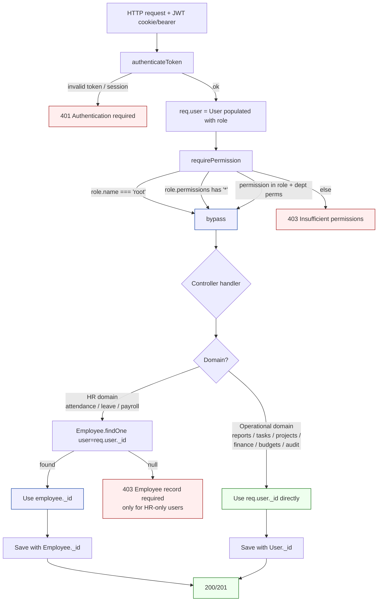

# RayERP — Identity Map (User vs Employee, with Root)

This document explains the two identity rails in RayERP — **User** (auth +
operations) and **Employee** (HR only) — how they relate, which models hang
off each, and how requests resolve from one to the other at runtime. It also
records the architectural decision that **project / task / reporting work
anchors on User, and Employee is reserved for HR**, plus the migration that
moved project reporting onto that model.

---

## 1. The relationship

```
User  ──1:1──>  Employee
                 ▲
                 │  Employee.user  (ref: 'User', required)
```

- **One declarative bridge:** `Employee.user`. (Plus a duplicate field pair
  in `BudgetActivity`.)
- **No reverse pointer.** A `User` does not store an `employee` id. Root is
  a User with no inbound `Employee.user` link — that used to break HR /
  reporting flows that conflated the two identities.
- The bridge is resolved at request time only where HR-anchored data is
  involved (attendance, leave, payroll). Project / task / reporting code
  now uses `req.user._id` directly.

---

## 2. Architectural rule

> **User** is the operational identity. Anything someone *does at work* in
> the system — creating reports, owning projects, being assigned tasks,
> approving entries, posting comments — is anchored on User.
>
> **Employee** is the HR identity. Attendance, leave, salary, career,
> achievements, supervisor/manager relationships, departments — anything
> that exists because the person is an *employee of the company* — is
> anchored on Employee.
>
> If a record could exist for a user who is **not** on payroll (root admin,
> external collaborator, founder), it must be anchored on User.

This is the rule the codebase is being aligned to. Some models still need
to be migrated (see §6 "Phase 2 — pending").

---

## 3. Entity & domain map

```
┌──────────────────────────────────────────────────────────────────────────────┐
│                                  USER  (auth + ops)                          │
│   _id  name  email  password  role→Role  permissions  status  lastLogin      │
│                                                                              │
│   Auth: comparePassword · generateAuthToken · generateRefreshToken           │
└──┬───────────────────────────────────────────────────────────────────────────┘
   │ 1 : 1  (Employee.user, required)            ▲
   │                                             │  Auth middleware populates
   │                                             │  req.user (role populated)
   ▼                                             │
┌──────────────────────────────────────────────────────────────────────────────┐
│                          EMPLOYEE  (HR only)                                 │
│   _id  employeeId  firstName/lastName  email  department  position           │
│        manager→Employee  supervisor→Employee  user→User                      │
└──────────────────────────────────────────────────────────────────────────────┘


      Satellites of USER                  │      Satellites of EMPLOYEE
                                          │
  Sessions / security                     │  HR
  ─ UserSession, UserAssignment,          │  ─ Attendance.employee
    UserCurrencySettings,                 │  ─ Leave.employee
    UserStatusRequest, UserProject        │  ─ Achievement, EmployeeCareer
  ─ AuditLog, ActivityLog                 │  ─ Employee.manager/supervisor
  ─ BackupLog, BackupSchedule             │  ─ Expense.employeeId (optional)
                                          │
  Finance / Accounting                    │
   (createdBy/approvedBy on USER)         │
  ─ AccountGroup/SubGroup/Type/Template   │
  ─ AccountLedger, AccountNote,           │
    ChartOfAccount, Ledger,               │
    PartyLedger, ProjectLedger            │
  ─ Finance, JournalEntry, JournalTpl,    │
    Voucher, Bill, BillPayment, Receipt   │
  ─ Transaction, BankStatement,           │
    DeliveryNote, PurchaseOrder           │
  ─ Tender, WorkOrder, MilestoneBilling   │
                                          │
  Budgeting / Workflow                    │
  ─ Budget, BudgetActivity,               │
    BudgetAlert, BudgetApprovalWorkflow,  │
    BudgetComment, BudgetForecast,        │
    BudgetTemplate, BudgetTransfer,       │
    BudgetVariance, BudgetReport          │
  ─ MasterBudget, DepartmentBudget,       │
    ProjectBudget, GLBudget, FiscalYear   │
  ─ ApprovalRequest, ApprovalWorkflow,    │
    WorkflowInstance, WorkflowTemplate    │
  ─ Scenario, AllocationRule,             │
    CashFlowRule, InterestCalculation,    │
    SmartAlert, ReportSchedule            │
  ─ TaxRecord, RecurringEntry             │
                                          │
  Communications / settings               │
  ─ Broadcast, Chat, Contact.createdBy    │
  ─ Notification, NotificationSettings    │
  ─ SavedFilter, Settings,                │
    InvoiceTemplate, FinancialDocument    │
                                          │
  Projects (owner-side)                   │
  ─ Project.owner          → USER         │
  ─ Project.createdBy      → USER         │
  ─ ProjectPermission.createdBy → USER    │
                                          │
  Project reporting  ✅ MIGRATED          │
  ─ DailyReport.reportedBy      → USER    │
  ─ DailyReport.acknowledgedBy  → USER    │
  ─ DailyReport.blockers.resolvedBy → USER│
  ─ FinancialEntry.reportedBy   → USER    │
  ─ FinancialEntry.approvedBy   → USER    │
  ─ ReportingSchedule.requiredFrom[].user │
  ─ ReportingSchedule.escalateTo → USER   │
  ─ ReportingSchedule.createdBy  → USER   │
                                          │
  Projects & tasks  ✅ MIGRATED           │
  ─ Project.managers[]          → USER    │
  ─ Project.team[]              → USER    │
  ─ ProjectPermission.user      → USER    │
  ─ Task.assignedTo, assignedBy → USER    │
  ─ Task.comments[].user        → USER    │
  ─ Task.comments[].mentions    → USER    │
  ─ Task.checklist.completedBy  → USER    │
  ─ Task.timeEntries[].user     → USER    │
  ─ Task.attachments.uploadedBy → USER    │
  ─ Task.watchers[]             → USER    │
                                          │
  Resources, timeline, files  ✅ MIGRATED │
  ─ ResourceAllocation.user     → USER    │
  ─ Timeline.user               → USER    │
  ─ FileShare.sharedBy          → USER    │
  ─ FileShare.sharedWith[]      → USER    │
  ─ FileShare.viewedBy[].user   → USER    │
  ─ FileShare.downloadedBy[].user → USER  │
```

---

## 4. Domain rule of thumb

| Domain                                          | Anchored on |
| ----------------------------------------------- | ----------- |
| Login, sessions, RBAC, audit                    | **User**    |
| Finance, accounting, vouchers, budgets, approvals | **User**  |
| Notifications, settings, broadcasts, chat       | **User**    |
| Project ownership / creation                    | **User**    |
| Project reporting (daily reports, financial entries, blockers) | **User** ✅ |
| Project team, managers, tasks (assignment, comments, watchers) | **User** ✅ |
| Resource allocations, project timeline events, file shares | **User** ✅ |
| HR (attendance, leave, achievements, career, salary) | **Employee** |

---

## 5. Runtime request flow (post-migration)



### How to read it

- Operational endpoints never call `Employee.findOne` for the actor. They
  use `req.user._id` directly as `reportedBy` / `acknowledgedBy` /
  `assignedTo` / `createdBy`.
- HR endpoints still resolve through Employee (because the data they touch
  is keyed on Employee — Attendance, Leave). A non-HR account hitting an
  HR endpoint is a legitimate 403.
- Root never gets blocked by an Employee lookup in the operational rail
  anymore — root has all permissions *and* now has full operational
  identity through its User record.

---

## 6. Migration status

### Phase 1 — DONE (project reporting)

Schemas flipped from `Employee` to `User`:

- `DailyReport.reportedBy` (required), `.acknowledgedBy`, `.blockers.resolvedBy`
- `FinancialEntry.reportedBy` (required), `.approvedBy`
- `ReportingSchedule.requiredFrom[].user` (renamed from `.employee`),
  `.escalateTo`

Controllers / services updated: `dailyReportController.ts`,
`financialEntryController.ts`, `reportingScheduleController.ts`,
`routes/projectReporting.routes.ts` (bulk handlers + weekly summary),
`services/reportingReminderService.ts`. Frontend types and display sites
in `lib/api/projectReportingAPI.ts`, `ProjectReporting.tsx`, and
`ProjectReportingTab.tsx` updated.

Removed: `backend/src/utils/employeeResolver.ts` (the shadow-Employee
band-aid — no longer needed once the architecture was fixed).

### Phase 2 — DONE (projects & tasks)

Schemas flipped from `Employee` to `User`:

- `Project.managers[]` (required), `Project.team[]`
- `ProjectPermission.user` (renamed from `.employee`)
- `Task.assignedTo` (required), `.assignedBy` (required)
- `Task.comments[].user`, `.comments[].mentions`
- `Task.checklist.completedBy`
- `Task.timeEntries[].user`
- `Task.attachments.uploadedBy`
- `Task.watchers[]`

Controllers / middleware / services updated:

- `middleware/projectAccess.middleware.ts` — pure User-based checks.
- `middleware/projectPermission.middleware.ts` — pure User-based checks;
  `Employee record not found` 403 removed.
- `middleware/taskPermission.middleware.ts` — `isAssignedToTask` /
  `isAssignedToProject` compare against `req.user._id` directly.
- `controllers/projectController.ts` — list / detail filters, manager
  /owner checks, `addMember` / `removeMember`, populates, and
  `ProjectPermission.create` now use User. The duplicate department
  fallback in `getProjectById` retains an `Employee.findOne` only to read
  `employee.departments` (HR data).
- `controllers/projectPermissionController.ts` — fully rewritten to use
  `user` field; accepts both `userId` and legacy `employeeId` in the
  body for transitional compatibility.
- `controllers/taskController.ts` — `getAllTasks`, `getTaskById`,
  `createTask`, `addTaskComment` all use User. The HR-only department
  fallback in `getTaskById` retains an `Employee.findOne`.
- `controllers/dailyReportController.ts`, `financialEntryController.ts`,
  `reportingScheduleController.ts` — Phase 1 Employee bridges removed
  now that `project.managers/team` are User refs.
- `controllers/projectAnalyticsController.ts`,
  `controllers/taskAnalyticsController.ts`, `taskBulkController.ts`,
  `taskCalendarController.ts`, `taskGanttController.ts`,
  `taskSearchController.ts`, `modules/projects/tasks/taskController.ts`,
  `modules/projects/timeline/timelineController.ts`,
  `modules/projects/permissions/permissionController.ts`,
  `utils/taskUtils.ts`, `utils/notificationEmitter.ts` — populate paths
  and identity comparisons updated.

Compat shim on `User`: added `firstName` / `lastName` virtuals that
derive from `name`, so existing UI code reading
`assignedTo.firstName + ' ' + assignedTo.lastName` keeps rendering until
the frontend is fully migrated to `.name`. Virtuals are serialized via
`toJSON: { virtuals: true }`. **This is a temporary shim — the
frontend should eventually read `.name` directly and the virtuals can
be removed.**

### Phase 3 — DONE (resources, timeline, files)

Schemas flipped from `Employee` to `User`:

- `ResourceAllocation.user` (renamed from `.employee`; required)
- `Timeline.user` (still named `user`; was secretly a ref to Employee
  despite the field name)
- `FileShare.sharedBy`, `.sharedWith[]`
- `FileShare.viewedBy[].user` (renamed from `.employee`)
- `FileShare.downloadedBy[].user` (renamed from `.employee`)

Controllers updated:

- `controllers/resourceController.ts` — CRUD endpoints (`allocateResource`,
  `getResourceAllocations`, `updateResourceAllocation`,
  `getResourceUtilization`, `detectResourceConflicts`,
  `getAllocationConflicts`, `getTimeTracking`, `validateAllocation`,
  `exportAllocations`, `getGanttData`) all use `user`; accept legacy
  `employee` / `employeeId` from body and query for transitional
  compatibility (mapped via `Employee.user`). HR-side enumeration
  endpoints (`getCapacityPlanning`, `getSkillMatrix`,
  `getSkillGapAnalysis`, `getEmployeeSummary`) still enumerate Employee
  for HR data, then look up allocations by `user: emp.user`.
- `controllers/fileShareController.ts` — fully rewritten; uses
  `req.user._id` directly; populate paths swapped to User name/email.
  Accepts legacy `employeeIds` array in body alongside preferred
  `userIds` for transitional compatibility.
- `utils/timelineHelper.ts` — populate `user` now selects `name email`.

### Phase 4 — cleanup

The only remaining `Employee.findOne({ user: user._id })` sites are in
HR controllers / middlewares (`leavePermission.middleware`,
`attendancePermission.middleware`, `departmentPermission.middleware`,
leave / attendance / department / profile / salary / contact
controllers). Those are correct as-is — they are genuine HR identity
gates. Plus the department-permission fallbacks in
`projectController.getProjectById` and `taskController.getTaskById`
that read `employee.departments` to gate basic-view access for
non-assigned employees, and the HR-side resource-planning endpoints
in `resourceController.ts` (skill matrix, capacity planning, gap
analysis) that enumerate Employee then bridge to User for the
allocation lookups.

---

## 7. Root user — properties and special-casing

Seeded by `backend/src/utils/seedDefaultRoles.ts` and `initializeRoles.ts`:

```
name: 'Root'
permissions: ['*']
level: 100        # ≥ 80, so any `isAdmin = level >= 80` check passes
isDefault: true
```

Root is already special-cased in:

- `middleware/auth.middleware.ts` — `requirePermission`, `requireAdminOrRoot`
- `middleware/rbac.middleware.ts` — `isRootRole` + bypass in
  `requirePermission` / `requireAnyPermission`
- `controllers/employeeController.ts` — skips employee check for
  Root/Super Admin in self-view endpoints
- `models/User.ts` — pre-save: cannot assign Root role to other users;
  pre-update/delete: Root user cannot be modified or deleted
- `models/Role.ts` — Root role cannot be modified or deleted
- Various controllers / sockets / cron jobs with their own root checks

After Phases 1 & 2, root no longer hits 403 anywhere on the operational
rail — project reporting, projects, tasks, comments, permissions all
accept root as a User. Root still hits the legitimate HR identity gate
on attendance, leave, and similar HR-only endpoints, which is correct:
those are for employees, not admins.

---

## 8. Data migration note

Phases 1 and 2 changed the *type* of stored ObjectIds across several
collections. Existing documents that referenced `Employee._id` will not
resolve when populated with the new `ref: 'User'`. For each affected
field, remap `Employee._id` → `Employee.user` (the linked User).

Affected fields (all of these store ObjectIds that need remapping):

- `DailyReport.reportedBy`, `.acknowledgedBy`, `.blockers.resolvedBy`
- `FinancialEntry.reportedBy`, `.approvedBy`
- `ReportingSchedule.requiredFrom[].user` (also rename field key from
  `employee` to `user`), `.escalateTo`
- `Project.managers[]`, `Project.team[]`
- `ProjectPermission.user` (also rename field key from `employee` to
  `user`)
- `Task.assignedTo`, `.assignedBy`, `.comments[].user`,
  `.comments[].mentions[]`, `.checklist[].completedBy`,
  `.timeEntries[].user`, `.attachments[].uploadedBy`, `.watchers[]`
- `ResourceAllocation.user` (also rename field key from `employee` to
  `user`)
- `Timeline.user`
- `FileShare.sharedBy`, `.sharedWith[]`, `.viewedBy[].user` (rename
  from `.employee`), `.downloadedBy[].user` (rename from `.employee`)

Sketch of a migration script: build a map `Employee._id → Employee.user`
once, then iterate each collection and replace each ObjectId via the
map. Drop any entries whose mapped User is missing (deleted employee
with no linked User account).

If the database has no pre-migration data for these collections (active
development before these features shipped to users), no migration is
needed.

If the database has no pre-migration project-reporting data (active
development before this feature shipped), no migration is needed.
